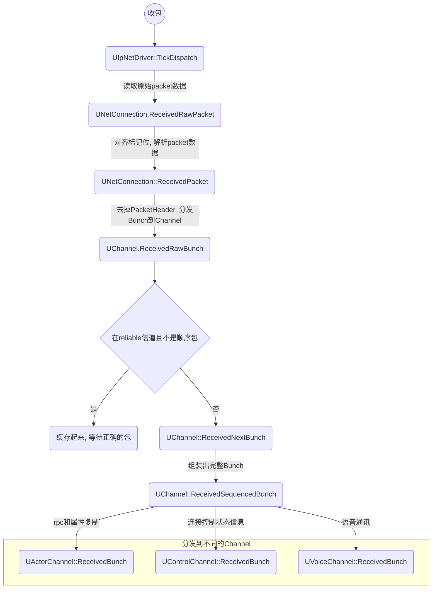
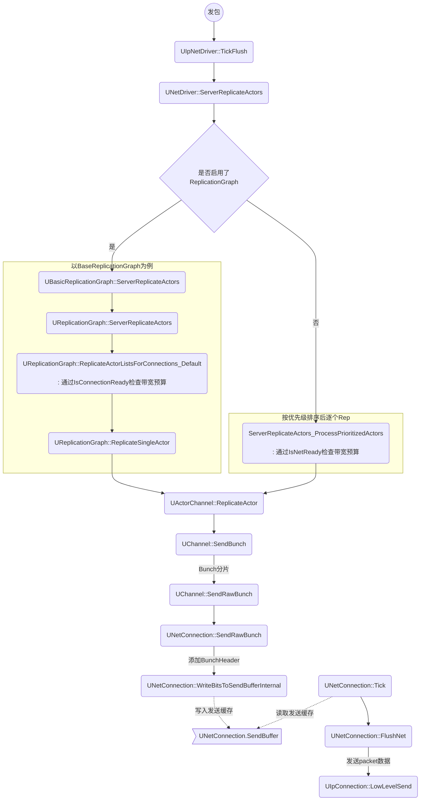

# 网络模块基础概念
### UNetDriver
- 两个实例子类
 + UIpNetDriver 负责标准网络连接
 + UDemoNetDriver 负责录制回放

- UNetDriver管理UNetConnections, DS拥有ClientConnections，客户端拥有ServerConnection
- RPC相关在这里处理：
	+ UNetDriver::ProcessRemoteFunction() 
	+ UNetDriver::ProcessRemoteFunctionForChannel()
- UNetDriver::TickDispatch负责接收网络数据，通过UNetConnection::ReceivedRawPacket将数据包传递到对应的连接中

### UNetConnection
#### 标准连接：UIpConnection

### UChannel
- UControlChannel
用于发送有关连接状态的信息
- UVoiceChannel
用于在客户端和服务器之间发送语音数据
- UActorChannel
交换角色及其子对象的属性和RPC的通道，UActorChannel管理复制的actor的创建和生存期。

# Replication收发包过程
## 收包


-------
## 发包



# Network Profile
## UNetConnection的统计
|   UNetConnection    | 上行              | 下行             | 备注             |
| ------------------ | ------------------- | ------------------ | ---- |
| 每秒内流量(Bytes) | OutBytesPerSecond | InBytesPerSecond | 实际压缩后的数据，且包括包头 |
| 每秒内包个数(Pack) | OutPacketsPerSecond | InPacketsPerSecond | 单个packet大小受MTU限制 |

## Network Insight的统计
 


# Replication的限流

## 发送速率

- 发送数据，每个UNetConnection有一个数据发送速率`CurrentNetSpeed`，表示每秒钟可以发送多少字节数据

### UE4的发送速率配置
DefaultEngine.ini

- 最大速率
  - [/Script/OnlineSubsystemUtils.IpNetDriver]
    MaxClientRate=100000
    MaxInternetClientRate=100000  // 非局域网条件下的MaxClientRate配置

- 实际速率`CurrentNetSpeed`
  - [/Script/Engine.Player]
    ConfiguredInternetSpeed=100000
    ConfiguredLanSpeed=100000

- 实际速率受最大速率限制，最小为1800

- 客户端、ds端的发送速率都由这些配置决定

## 带宽预算

- 发送数据，每个UNetConnection有带宽预算`UNetConnection.QueuedBits`，小于0，表示这一帧还可以发送多少bit数据 
- **带宽预算**受到**发送速率**的影响

### 带宽预算的分配和消耗
UNetConnection::Tick里根据CurrentNetSpeed计算分配当前的带宽预算，由于预算可以累积，为了避免过多的预算可能导致下一帧发送太多数据，预算钳制在两倍范围内
```c++
void UNetConnection::Tick(float DeltaSeconds)
{
	...
	float DeltaBits = CurrentNetSpeed * BandwidthDeltaTime * 8.f;
	QueuedBits -= FMath::TruncToInt(DeltaBits);
	float AllowedLag = 2.f * DeltaBits;
	if (QueuedBits < -AllowedLag)
	{
		QueuedBits = FMath::TruncToInt(-AllowedLag);
	}
}
```

UNetConnection::FlushNet里面，发送了多少数据，会消耗掉预算
```c++
void UNetConnection::FlushNet(bool bIgnoreSimulation)
{
	...
	QueuedBits += (PacketBytes * 8);
}
```
### 带宽预算检查
- 有ReplicationGraph时，通过UReplicationGraph::IsConnectionReady检查带宽预算
  + 可以通过命令`Net.RepGraph.DisableBandwithLimit 1`动态关闭预算检查，任性地使用网络流量带宽
- 没有ReplicationGraph时，通过UNetConnection::IsNetReady检查带宽预算
  + 可以通过命令`net.DisableBandwithThrottling 1`动态关闭预算检查，任性地使用网络流量带宽（非shipping版本有效）

带宽预算不足时，发送会延后。


# 带宽优化

## ReplicationGraph

- 启用插件ReplicationGraph

- 两种方式开启ReplicationGraph

1. 配置

   [/Script/OnlineSubsystemUtils.IpNetDriver]

   ReplicationDriverClassName="/Script/ReplicationGraph.BasicReplicationGraph"

2. 代码里注册

   在UNetDriver::InitBase前注册一下ReplicationGraph
```c++
UReplicationDriver::CreateReplicationDriverDelegate().BindLambda([](UNetDriver* ForNetDriver, const FURL& URL, UWorld* World) -> UReplicationDriver*
{
	return NewObject<UReplicationDriver>(GetTransientPackage(), UYouDerivedReplicationGraph::StaticClass());
});
```

- Adaptive Network Update Frequency

  By default, this feature is deactivated. Setting the console variable `net.UseAdaptiveNetUpdateFrequency` to `1` will activate it.


## Oodle Network

https://docs.unrealengine.com/4.27/en-US/TestingAndOptimization/Oodle/Network/

tips：
1. 需要离线训练，生成字典文件，游戏涉及较大更新时，可能需要重新训练并生成新的字典文件，再发布打包；
2. 字典文件在server端 / client端都分别需要。
3. 占用内存

## PropertyHandle合并


​		每个PropertyHandle都会占用8bit，将多个property字段合并为一个struct，整体做NetSerialize，可以减少PropertyHandle占用，但需要注意的是，这可能也导致发生同步属性变化的几率会增加（struct里面有任何变化，整体就被认为需要传输），需要综合权衡，把一起变化的字段放到一起合并为struct。

http://www.aclockworkberry.com/custom-struct-serialization-for-networking-in-unreal-engine/