## 前言

ASTC格式作为当前最新的gpu纹理格式，有很多的**优势**：

1. 对纹理尺寸无要求，支持alpha

2. 较新的Android和IOS都支持

3. 纹理精度与压缩比特率多级可调节，可以选择block大小从4x4到12x12，相应的比特率从8bpp到0.89bpp

​		但目前只有离线压缩工具（ARM ASTC-encoder， Intel的ISPC），压缩过程很慢，关键是游戏中运行时生成的纹理，就无法利用压缩贴图了。

​		为此，研究用computershader进行实时的纹理压缩，首先我们的目标是对LDR的2D纹理，选取block大小为4x4和6x6，通过分析ASTC纹理压缩的原理和参数搜索过程，鉴于ASTC纹理格式本身复杂，可选参数又极多，对参数搜索等进行一些必要的简化，去掉耗时大精度提升有限的搜索，利用computeshader的高度并行性，在运行时实时地进行纹理的ASTC压缩编码，在压缩纹理精度上达到可接受，在压缩速度上保证实时，并尽可能提高速度，提升精度。


## 基于块的有损压缩原理

​		基于块的有损压缩算法基于颜色的局部相关性假设，把像素看作是RGB/RGBA空间中的点，在这个空间中找一个线段，其他所有像素都用这个线段的两个端点（称为**endpoints**）的插值来表示。

* 一个块内的颜色值比较少，可以拟合到RGB空间的一个直线上。
* 但是这种单线性拟合对于有些情况来说，质量损失严重。举个最简单的例子，如果一个4×4的 block中包含红色、蓝色、绿色的三个像素，只用一个线段插值压缩后必然会有个颜色精度丢失很大。
* BC7引入了像素子集划分的思路，把块内的像素集分成多个子集，每个子集独立选出一个线段进行像素插值。像素子集的划分，称为**partition**。

## ASTC的改进

* ASTC也是一种基于块的有损压缩算法，提供了4x4到12x12的多种块大小，每个Block块都压缩为固定的128bit，不同的块大小就对应于不同的压缩率。

* ASTC沿用了BC7的partition，但是增加到了最多可以划分成4个子集，就有划分成2个子集，3个子集，4个子集，共三种情形，每种情形有1024种划分方式，总共3072种划分方式，相对于BC7的64种Partition复杂了很多。编码时用2个bit存partition count-1，10个bit存partition index。

* ASTC提出的有界整数序列压缩(**BISE** bounded integer sequence encoding)，更紧凑的整数序列编码，可以达到分数级的bit per value。**正是由于有了这个特性，才使得ASTC能有广泛的不同级别的压缩比特率。**

## ASTC的搜索参数空间大小估算
* Partition数量：3072 + 1
* DualPlane：2
* 合法的Blockmode种类：占用11bit，2048的量级
* color endpoint modes(CEM)字段：multi partition情况下占6bit，single partition情况下占4bit
总的搜索量级：3073 \* 2 \* 2048 \* 16 = 201392128 ~ **约2亿量级**

## ASTC压缩的精度损失来源分析
ASTC压缩的精度损失主要来自下面三个方面：
1. 基于主轴进行颜色插值的插值误差
	
	处在主轴线上的点是可以被精确插值的，离主轴距离为d的点，插值误差即可由d来衡量。

	
	
2. endpoints的量化误差
          
          量化Range为$$R$$，256个像素级，量化分配到$$R$$个值上，形成$$R-1$$个像素范围，平均每个像素级范围大小为$$\lceil256/(R-1)\rceil$$，取范围中心进行反量化，则像素量化误差为：$$\lceil256/(R-1)\rceil/2$$，**随着R越小，误差越大**。
      
         例如：量化范围$$R=48$$时，对颜色值$$c = 8$$进行量化，再反量化后，颜色值还原为5，误差为3。用$$Range=256$$的话，就相当于无损失的量化了。
      
3. weights的量化误差
          
   
          量化Range为$$R$$，那么权重$$w(0 \leq w \leq 1)$$的量化误差为：$$|w - [w*R+0.5] / R|$$，由于$$w*R$$与$$[w*R+0.5]$$相差最多0.5，因此误差最大值是$$0.5/R$$，**随着R越小，误差越大**。
      
4. weights网格的插值误差
       
       除了3d纹理的z方向上外，权重网格在各个对应维度上可以小于实际的块大小。用双线性插值来拟合。
   
   

## ASTC块的编码组成

* 开始的bit数据是配置数据
* endpoints颜色数据在配置数据之后。
* 128bit里，weights数据在尾部，按bit位倒着排列。
* weights和endpoint数据占用多少位是不固定的，取决于blockmode和整个128bit的分配，总体而言weighs占用bit越多，endpoint占用bit就越少，反之亦然。就是要找到一个最优的bit分配。


## block mode的组成


* blockmode是位于128bit的最开头的固定的11bit。

* Blockmode里定义了权重weights的量化范围，权重网格的大小。

​        由权重量化范围，间接决定了endpoints的量化范围。根据整个128bits减去weights的编码占用和其他配置占用后剩余的bits位数可以确定endpoints的bit位数。


## single partition & multi partition
$$\quad\quad$$基本就是根据像素在block内的坐标，通过固定的hash函数生成partition划分。block越大，越有可能要划分multi partition。对于一个block，如何选取划分为几个子集，划分为怎样的子集，才有更好的压缩精度，ARM-ASTC有先对像素聚类，但基本上还是在穷举搜索各种partition。
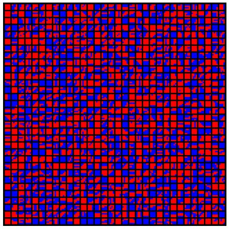

block 4\*4的所有1024个2-Partition的样式

### Benchmark图像

| 含有红绿蓝三色的4x4的图像 | 使用single partition方式压缩 | 使用2-partition方式压缩 |
| :------:| --------- | --------|
|| |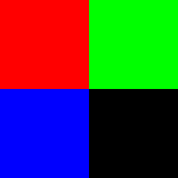 |

## dual planes
* BlockMode Layout里有个D字段，表示是否像素的rgba通道中有任何通道要进行分开编码，也就是会有两套endpoints和权重网格。这一般是由于像素中含有互相不太相关的通道，比如NormalMap，透明遮罩等。
* Partition划分对DualPlanes的各个通道是相同的，也就是分离的两部分通道是属于同一个Partition，有相同的Partition Index。
* dual plane需要两套endpoints和权重数据，占用bits位数要更多，但是另一方面，由于把不相关的通道分离了，那每个Plane里的像素相关度就很高了，可以找出更精确的endpoints。
那是否采用dual plane就取决于压缩精度需要，ARM-ASTC把两种情况都纳入了参数搜索尝试，对此进行精度比较，取最优的方式。


## ARM-ASTC离线压缩的大致步骤

1. 选取划分
2. 对每个划分子集计算endpoints
3. 将划分里的像素表示为endpoints的插值，计算插值权重weights。
4. endpoints量化，BISE编码
5. weights量化，BISE编码
6. 组装为128bit块

在上述过程中进行划分集的搜索，权重网格大小的搜索，endpoints / weights的量化范围的搜索


## ComputeASTC的简化考虑

1. 基于性能开销考虑，不做partitions搜索
	- 只用Block4x4、6x6
2. 权重网格用4x4的大小
	- 对于Block4x4就没有权重网格插值误差了
3. 只进行权重weights的量化范围的搜索
	- 忽略dual plane，color endpoint modes的搜索


## 纹理压缩的精度指标PSNR


## endpoints的计算
对比了4种方法：
1. Pixel pair with max euclidean distance（Waveren:Real-Time_DXT_Compression）：计算具有最远距离的一对像素点。

2. BoundingBox：取像素点集包围盒的对角线作为主轴方向。（boundingbox仅仅取决于少数最外面的像素点，丢失统计信息）

3. Max accumulation pixel direction（from ARM-ASTC）：减去平均值偏移后，累加rgba各个方向的像素，然后取长度最大的向量的方向作为主轴方向。

4. [PCA](https://en.wikipedia.org/wiki/Principal_component_analysis)：将RGB/RGBA数据从3/4维降低到1维。

## 用PCA计算endpoints
### PCA原理

$$\quad\quad$$讲[PCA](https://www.cnblogs.com/pinard/p/6239403.html)原理的资料很多，从数据分析角度，就是数据降维。而从几何角度来看，从RGB三维降到一维，就是要在像素RGB空间中找一个主轴方向，使得所有像素到这个轴的距离平方和最小。
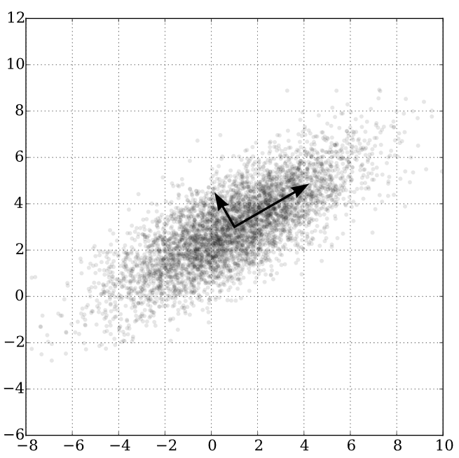

### PCA过程

1. 去均值化
	+ 先计算像素平均值，然后减去平均值。
2. 计算[协方差矩阵](https://en.wikipedia.org/wiki/Covariance)
	+ 把rgb/rgba看作是3/4个随机变量，把block4x4内的像素值看作16个rgb/rgba数据样本，计算协方差矩阵（3x3 或者 4x4） 
3. 计算协方差矩阵的最大特征值对应的特征向量
    + 这可以使用[幂次法](http://mlwiki.org/index.php/Power_Iteration)，用矩阵反复多次乘一个非零的初始向量，然后归一化得到。
4. 计算endpoints
	+ 最大特征值对应的特征向量就是主轴方向，把原像素减去均值后，往主轴方向投影，获取投影方向上的有向距离坐标，取对应坐标最大的和最小的像素作为endpoints，同时对这个坐标归一化后，就是后续需要存储的像素的权重了。

## pixels weights

* weight grids：除了3d纹理的z方向上外，权重网格宽高数目可以小于等于像素网格，小于时，会使用双线性插值。
* 权重数据要先进行归一化，再进行量化。
* 权重量化level的确定：level越大精度越高，但会占用更多bit位，影响颜色量化编码，影响颜色值精度。
* weights序列化顺序：逐像素按width, height, depth顺序。

## quantization
* 量化就是用尽可能少的bit位去表示给定的数据。
* quantization level

### 1. weights quantization
* 权重量化过程：将weights数据从归一化的浮点值，映射到整数值。 
  * [0 ~ 1] 的weights \* quantization level -> integer > 查找权重量化表得到最终量化值

### 2. color quantization
* 颜色量化level的确定：endpoints_quant是根据整个128bits减去weights的编码占用和其他配置占用后剩余的bits位数来确定的。
* 颜色量化过程
	* 不同的color endpoint modes(CEM)有不同的编码方案，确定CEM后，再根据量化level，查找颜色量化表。


## blockmode搜索

​       blockmode搜索的主要目的是选取最优的endpoints和weights量化级别。通过先压缩再解压，取误差最小的组合。

| No Alpha：CEM_LDR_RGB_DIRECT |               | Has Alpha：CEM_LDR_RGBA_DIRECT |               |
| ---------------------------- | ------------- | ------------------------------ | ------------- |
| 权重范围                     | Endpoints范围 | 权重范围                       | Endpoints范围 |
| QUANT_3                      | QUANT_256     | QUANT_3                        | QUANT_256     |
| QUANT_4                      | QUANT_256     | QUANT_4                        | QUANT_256     |
| QUANT_5                      | QUANT_256     | QUANT_5                        | QUANT_256     |
| QUANT_6                      | QUANT_256     | QUANT_6                        | QUANT_256     |
| QUANT_8                      | QUANT_256     | QUANT_8                        | QUANT_192     |
| QUANT_12                     | QUANT_256     | QUANT_12                       | QUANT_96      |
| QUANT_16                     | QUANT_192     | QUANT_16                       | QUANT_48      |
| QUANT_20                     | QUANT_96      | QUANT_20                       | QUANT_32      |
| QUANT_24                     | QUANT_64      | QUANT_24                       | QUANT_24      |
| QUANT_32                     | QUANT_32      | QUANT_32                       | QUANT_12      |

```c++
// candidate blockmode uint4(weights quantmethod, endpoints quantmethod, weights range, endpoints quantmethod index of table)
#define BLOCK_MODE_NUM 10
static const uint4 block_modes[2][BLOCK_MODE_NUM] =
{
	{ // CEM_LDR_RGB_DIRECT
		uint4(QUANT_3, QUANT_256, 3, 7),
		uint4(QUANT_4, QUANT_256, 4, 7),
		uint4(QUANT_5, QUANT_256, 5, 7),
		uint4(QUANT_6, QUANT_256, 6, 7),
		uint4(QUANT_8, QUANT_256, 8, 7),
		uint4(QUANT_12, QUANT_256, 12, 7),
		uint4(QUANT_16, QUANT_192, 16, 6),
		uint4(QUANT_20, QUANT_96, 20, 5),
		uint4(QUANT_24, QUANT_64, 24, 4),
		uint4(QUANT_32, QUANT_32, 32, 2),
	},

	{ // CEM_LDR_RGBA_DIRECT
		uint4(QUANT_3, QUANT_256, 3, 7),
		uint4(QUANT_4, QUANT_256, 4, 7),
		uint4(QUANT_5, QUANT_256, 5, 7),
		uint4(QUANT_6, QUANT_256, 6, 7),
		uint4(QUANT_8, QUANT_192, 8, 6),
		uint4(QUANT_12, QUANT_96, 12, 5),
		uint4(QUANT_16, QUANT_48, 16, 3),
		uint4(QUANT_20, QUANT_32, 20, 2),
		uint4(QUANT_24, QUANT_24, 24, 1),
		uint4(QUANT_32, QUANT_12, 32, 0),
	}
};
```
​		权重的量化范围确定后，Endpoints的量化范围就可以根据剩余的bit位来确定下来。通过计算各个可能的权重量化范围，计算得到上面的这个表。

​		分有无alpha，对每一个endpoints和weights权重范围组合，进行一次压缩和解压，计算压缩误差，取误差最小的组合。**这个明显是很影响时间性能的。在fast版本里，我们就避免做这个搜索了。固定的blockmode带alpha为QUANT_6, QUANT_256，不带alpha为QUANT_12, QUANT_256。**

固定的blockmode带alpha和不带alpha分别的量化级别是：

```cpp
color_endpoint_mode = CEM_LDR_RGBA_DIRECT;
weight_quant = QUANT_6;
endpoints_quant = QUANT_256;
```
和：
```cpp
color_endpoint_mode = CEM_LDR_RGB_DIRECT;
weight_quant = QUANT_12;
endpoints_quant = QUANT_256;
```


## bounded integer sequence encoding(BISE)
​		BISE是编码有界整数序列的高效无损算法，充分利用了整数的有界性。对于有界整数序列，指定了整数范围后，就确定了编码后的总bit位数。对于$$S$$个有界整数的序列，根据数据范围，归类到下面三种模式：

|压缩模式|整数范围$$R$$|对$$S$$个整数压缩后的bit数|
| ---- | ---- | ---- |
| Binary |$$[0, 2^n-1]$$ | $$n*S$$ |
| Base3 |$$[0, 3 * 2^n-1]$$ | $$ n*S + \lceil 8S/5 \rceil $$ |
| Base5 |$$[0, 5 * 2^n-1]$$ | $$ n*S + \lceil 7S/3 \rceil $$ |

​		按组编码，Base3为每5个数一组（Base5为每3个数一组），每个数会被分成高位和低位，高位组合编码，低位直接存储。高位和低位的分割只取决于数据范围Range。下面的数组每行的第一列即表示那个Range下，高低位bit的分割位置。

``` c++
const uint8 bits_trits_quints_table[QUANT_MAX][3] = {
    {1, 0, 0},  // RANGE_2
    {0, 1, 0},  // RANGE_3
    {2, 0, 0},  // RANGE_4
    {0, 0, 1},  // RANGE_5
    {1, 1, 0},  // RANGE_6
    {3, 0, 0},  // RANGE_8
    {1, 0, 1},  // RANGE_10
    {2, 1, 0},  // RANGE_12
    {4, 0, 0},  // RANGE_16
    {2, 0, 1},  // RANGE_20
    {3, 1, 0},  // RANGE_24
    {5, 0, 0},  // RANGE_32
    {3, 0, 1},  // RANGE_40
    {4, 1, 0},  // RANGE_48
    {6, 0, 0},  // RANGE_64
    {4, 0, 1},  // RANGE_80
    {5, 1, 0},  // RANGE_96
    {7, 0, 0},  // RANGE_128
    {5, 0, 1},  // RANGE_160
    {6, 1, 0},  // RANGE_192
    {8, 0, 0}   // RANGE_256
};
```

### 压缩思路
举个例子：

​            考虑编码5个范围在[0,2]的整型数据，naive的想法是每个数据用2bit，5个数需要10bit，BISE的想法是每个数据有3可能，5个数排列的话总共有($$3^5 = 243$$)种可能，用8bits的就可以存储所有的这些组合了，每个数据仅需要(8/5=1.6bit)。

### BISE的压缩过程
1. 确定压缩模式
2. 确定高低位分割位置
3. 分组编码
   按组编码，Base3为每5个数一组（Base5为每3个数一组），每个数会被分成高位和低位，高位组合编码，低位直接存储。高位和低位的分割只取决于数据范围Range。        

#### BISE编码表
​            bits_trits_quints_table数组的每行的第一列即表示那个Range下，高低位bit的分割位置。第二列和第三列表示是用Base3还是Base5编码。
```c++
 /**
  * Table that describes the number of trits or quints along with bits required
  * for storing each range.
  */
static const uint bits_trits_quints_table[QUANT_MAX * 3] =
{
	1, 0, 0,  // RANGE_2
	0, 1, 0,  // RANGE_3
	2, 0, 0,  // RANGE_4
	0, 0, 1,  // RANGE_5
	1, 1, 0,  // RANGE_6
	3, 0, 0,  // RANGE_8
	1, 0, 1,  // RANGE_10
	2, 1, 0,  // RANGE_12
	4, 0, 0,  // RANGE_16
	2, 0, 1,  // RANGE_20
	3, 1, 0,  // RANGE_24
	5, 0, 0,  // RANGE_32
	3, 0, 1,  // RANGE_40
	4, 1, 0,  // RANGE_48
	6, 0, 0,  // RANGE_64
	4, 0, 1,  // RANGE_80
	5, 1, 0,  // RANGE_96
	7, 0, 0,  // RANGE_128
	5, 0, 1,  // RANGE_160
	6, 1, 0,  // RANGE_192
	8, 0, 0   // RANGE_256
};
```

​          比如，在序列4,78,55中，大于78的最小的满足三种格式的数分别是：2^7=128; 3∗2^5=96; 5∗2^4=80，其中80为最小，所以可以使用RANGE_80基于5的BISE，RANGE_80决定了共有7bit，高低位分割位置为4。
​          这三个数的二进制表示为｛000 0100, 100 1110, 011 0111｝，高三位的组合为｛000，100，011｝，低四位的组合为｛0100, 1110, 0111｝，而这3个高三位bits序列中的最大值是4，最小值是0，所以这高三位bits最多有5种情况，那么这3个高三位bits的排列组合总共可能有5^3=125种组合情况，这样的话就可以使用7bits的空间来存储这个组合，将原来需要3∗3=9bits的数据存储在7bits中，进而达到压缩的目的。余下的3个低四位的数据是直接存储，拼接在一起的，经过BISE编码后的bit序列为: {110, 11100111, 01010100}

### BISE有着接近信息熵的bit编码效率
​        每个整数需要的bit数 (BitPerValue)：$$ B=(n*S + \lceil 8S/5 \rceil) / S $$ 或者  $$ B=(n*S + \lceil 7S/3 \rceil) / S $$，随着S越大取极限的话，分别趋近于8/5 或者7/3，接近于信息熵$$\log_2{3}$$和$$\log_2{5}$$。

**bit的信息量编码效率：**
   $$S$$个范围在$$R$$内等概率分布的正整数，每个正整数的信息量为：$$I=\log_2{R}$$，那么每个bit的信息量：$$I/B = (\log_2{R}) / B$$
[下图横轴为整数范围，纵轴为每个bit的信息量](https://www.highperformancegraphics.org/previous/www_2012/media/Papers/HPG2012_Papers_Nystad.pdf)


## ComputeShader
* 一个thread处理一个block，避免thread间冲突需要同步

***thread数目** thread数目(numThreads的乘积) 有最大值限制 (kernel threadgroup size limit)。
 而且GPU一次Dispatch会调用64（AMD称为wavefront）或32（NVIDIA称为warp）个线程（这实际上是一种SIMD技术），所以，numThreads的乘积最好是这个值的整数倍。

***group数目** 一个group里的thread数目由shader里的宏定义；Dispatch出的group数目由纹理大小，按一个thread处理一个astc的block来计算确定。
group尺寸的分配需要考虑纹理采样的cached友好性。[Optimizing Compute Shaders for L2 Locality using Thread-Group ID Swizzling](https://developer.nvidia.com/blog/optimizing-compute-shaders-for-l2-locality-using-thread-group-id-swizzling/)

### 纹理mips合并batch

* 把纹理各级mips合并为一个batch
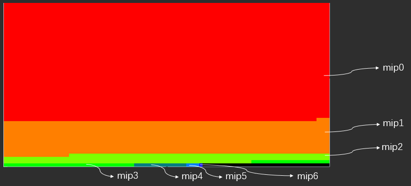


## 实验结果

### 4x4和6x6的实际压缩精度
#### 1. 单图

| Origin | ARM fast 4x4 PSNR: 37 |
| :------: | :------: |
|||

| ComputeASTC4x4 PSNR: 34.22 | ComputeASTC6x6 PSNR: 29.34 |
| :------: | :------: |
|||

|  “ARM fast 4x4” - “Origin”   | “ComputeASTC4x4” - “Origin” | “ComputeASTC6x6” - “Origin” |
| ---- | ---- | ---- |
|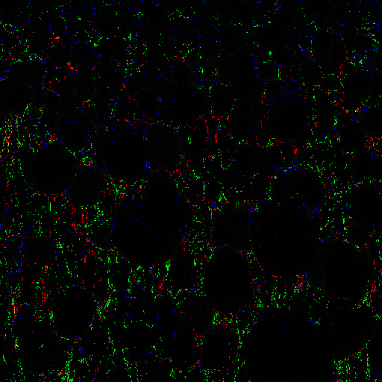|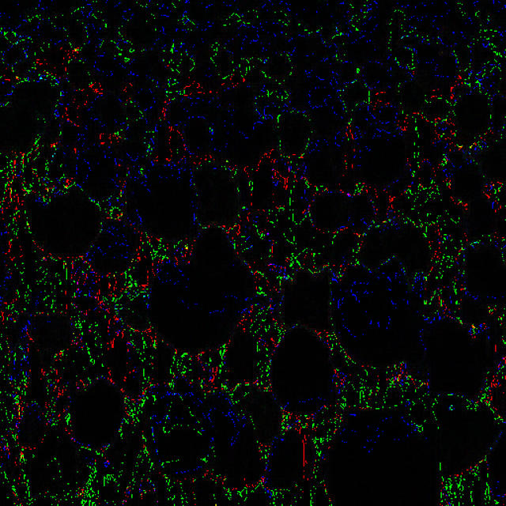||

| Origin with alpha channel     | ComputeASTC 4x4 PSNR:38.08 | ComputeASTC 6x6 PSNR:34.92 |
| ---- | ---- | ---- |
|||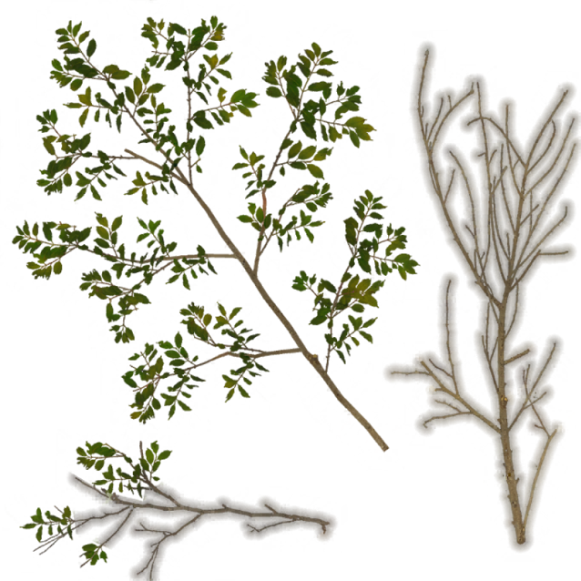 |

| Normal Map origin    | ComputeASTC 4x4  PSNR: 43.74 |
| ---- | ---- |
||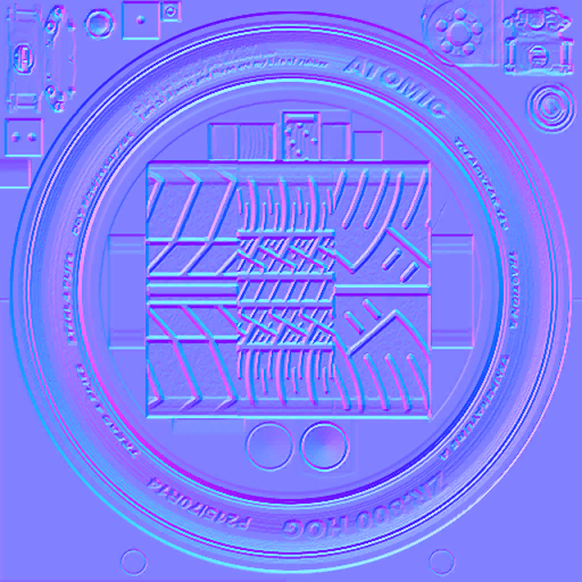|

#### 2. 多图PSNR（峰值信噪比）对比

测试纹理：从GTA5里导出的220张纹理
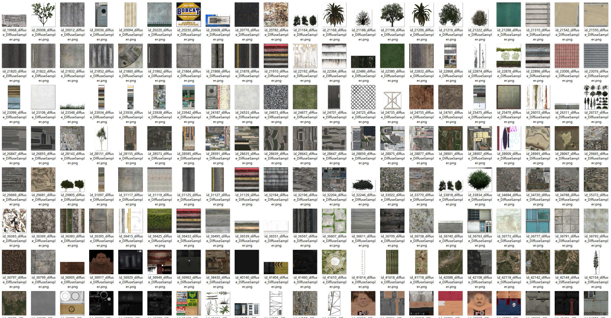

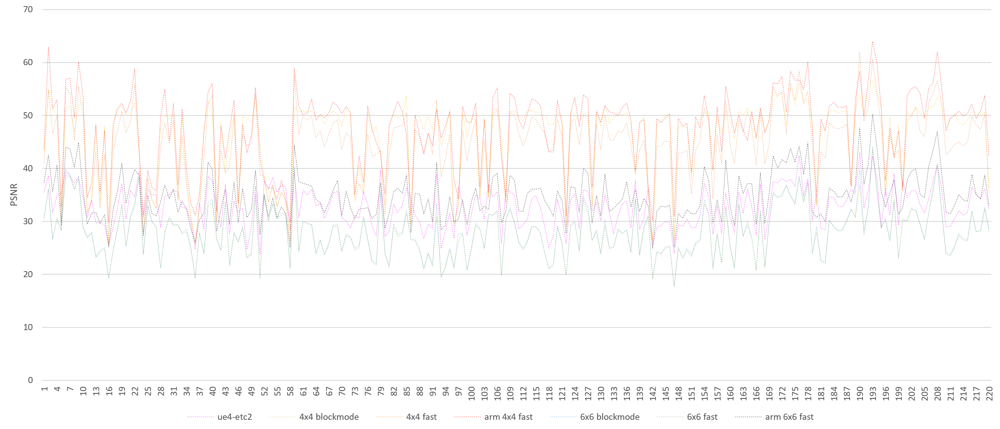

**总体精度上远好于UE4-etc2，十分接近ARM-ASTC fast离线压缩。**

### 各Endpoints算法的结果比较

#### 各Endpoints算法的精度比较

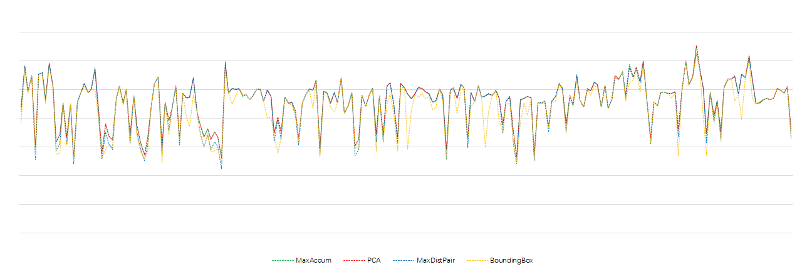

PCA的PSNR基本是最优的！MaxAccum与PCA非常接近


#### 各Endpoints算法时间开销比较

压缩时间开销(1024 4x4 fast on iphone12)：

| Method  | Time(ms) |
| -------- | -------- |
| MaxAccum    | 1.97     |
| PCA         | 2.37     |
| BoundingBox | 1.61     |
| MaxDistPair | 8.25     |

MaxDistPair时间开销较大，BoundingBox精度较差，只考虑用MaxAccum或者PCA。
时间开销上除了MaxDistPair外差别不大，综合考虑用MaxAccum。


### 性能开销统计

| 全mips压缩 | IPhone6s+（ms） | IPhone12 (ms)|
| ---- | ---- | ---- |
| 512 4x4 fast | 0.75 | 0.53 |
| 512 6x6 fast | 1.13| 0.52 |
|1024 4x4 fast | 2.07| 1.97 |
| 1024 6x6 fast | 3.87| 1.88 |
| 2048 4x4 fast |\*| 6.16 |
| 2048 6x6 fast |\*| 6.88 |
|\*|\*|\*|
| 512 4x4 blockmode | 5.72| 4.35 |
| 512 6x6 blockmode | 10.51| 7.44 |
| 1024 4x4 blockmode |\*|\*|
| 1024 6x6 blockmode |\*|\*|

**同条件下与UE4.26 ETC2的对比：**

|方案|GPU时间开销|
| ---- | ---- |
|1024 RGBA8-NoMips UE4-ETC2 @ IPhone12 |0.85ms|
|1024 4x4-NoMips ComputeASTC @ IPhone12 |1.31ms|


# [reference]

1. [https://www.khronos.org/registry/OpenGL/extensions/KHR/KHR_texture_compression_astc_hdr.txt](https://www.khronos.org/registry/OpenGL/extensions/KHR/KHR_texture_compression_astc_hdr.txt)
2. [https://www.khronos.org/registry/DataFormat/specs/1.2/dataformat.1.2.html#ASTC](https://www.khronos.org/registry/DataFormat/specs/1.2/dataformat.1.2.html#ASTC)
3. [https://github.com/ARM-software/astc-encoder](https://github.com/ARM-software/astc-encoder)
4. [https://developer.arm.com/architectures/media-architectures/astc](https://developer.arm.com/architectures/media-architectures/astc)
5. [https://developer.nvidia.com/astc-texture-compression-for-game-assets](https://developer.nvidia.com/astc-texture-compression-for-game-assets)
6. [http://delivery.acm.org/10.1145/2390000/2383812/supp/astc-supplemental-material.pdf](http://delivery.acm.org/10.1145/2390000/2383812/supp/astc-supplemental-material.pdf)
7. [https://developer.arm.com/-/media/Files/pdf/graphics-and-multimedia/Stacy_ASTC_white%20paper.pdf](https://developer.arm.com/-/media/Files/pdf/graphics-and-multimedia/Stacy_ASTC_white%20paper.pdf)
8. DANIEL OOM. Real-Time Adaptive Scalable Texture Compression for the Web
9. Nystad.2012. Adaptive Scalable Texture Compression
10. [http://www.reedbeta.com/blog/understanding-bcn-texture-compression-formats/](http://www.reedbeta.com/blog/understanding-bcn-texture-compression-formats/)
11. [https://rockets2000.wordpress.com/2018/01/09/astc-partitions/](https://rockets2000.wordpress.com/2018/01/09/astc-partitions/)
12. Oskar. Compressing dynamically generated textures on the GPU
13. [https://community.arm.com/developer/tools-software/graphics/b/blog/posts/arm-unveils-details-of-astc-texture-compression-at-hpg-conference---part-1](https://community.arm.com/developer/tools-software/graphics/b/blog/posts/arm-unveils-details-of-astc-texture-compression-at-hpg-conference---part-1)
14. [https://community.arm.com/developer/tools-software/graphics/b/blog/posts/astc-texture-compression-arm-pushes-the-envelope-in-graphics-technology](https://community.arm.com/developer/tools-software/graphics/b/blog/posts/astc-texture-compression-arm-pushes-the-envelope-in-graphics-technology)
15. [https://zh.wikipedia.org/wiki/主成分分析](https://zh.wikipedia.org/wiki/主成分分析)
16. [https://zh.wikipedia.org/wiki/协方差矩阵](https://zh.wikipedia.org/wiki/协方差矩阵)
17. [https://www.cnblogs.com/pinard/p/6239403.html](https://www.cnblogs.com/pinard/p/6239403.html)
18. [http://mlwiki.org/index.php/Power_Iteration](http://mlwiki.org/index.php/Power_Iteration)
19. [https://www.researchgate.net/publication/259000525_Real-Time_DXT_Compression](https://www.researchgate.net/publication/259000525_Real-Time_DXT_Compression)
20. [https://www.highperformancegraphics.org/previous/www_2012/media/Papers/HPG2012_Papers_Nystad.pdf](https://www.highperformancegraphics.org/previous/www_2012/media/Papers/HPG2012_Papers_Nystad.pdf)
21. [https://developer.nvidia.com/blog/optimizing-compute-shaders-for-l2-locality-using-thread-group-id-swizzling](https://developer.nvidia.com/blog/optimizing-compute-shaders-for-l2-locality-using-thread-group-id-swizzling)
22. [https://solidpixel.github.io/2020/03/02/astc-compared.html](https://solidpixel.github.io/2020/03/02/astc-compared.html)
23. [https://prtsh.wordpress.com/2013/12/29/adaptive-scalable-texture-compression/](https://prtsh.wordpress.com/2013/12/29/adaptive-scalable-texture-compression/)