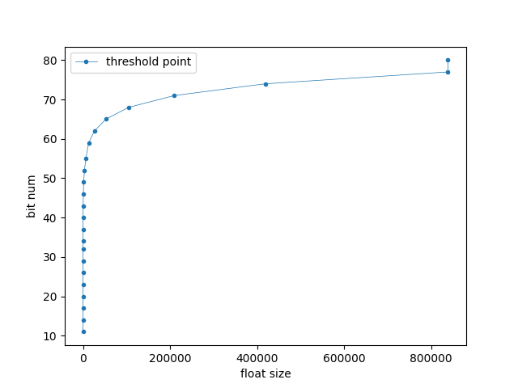
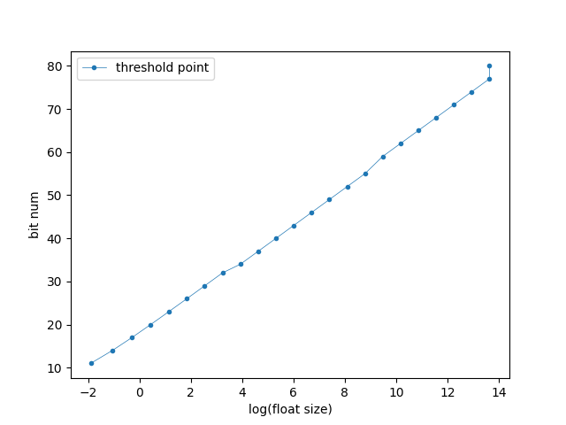
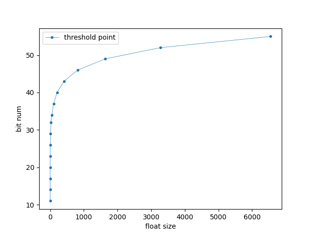
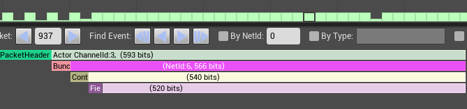
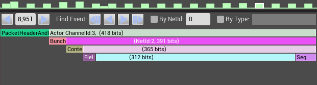

# 1. 前言
> 客户端的上行高频RPC同步包，往往会占用很大的网络数据带宽，这里给出一个针对非可靠高频上行RPC的网络带宽压缩方案。

# 2. 方案思路

​        高频的RPC同步包序列，很多时候，相邻同步包序列里的数据本身变化并不大，某些字段可能根本就没有变化，或者即使有些数值变化了，变化量相对也很小。与其每次都发送全量的数据，不如考虑在发送了全量数据后，后续只发送序列间的差量数据，然后在接收端还原出全量数据，这对高频的RPC来说，可以节省大量的带宽。

重点要考虑的有两个问题：

+ 如何从序列数据生成差量数据
+ 差量数据的高性能高比例压缩

# 3. 从序列数据生成差量数据
## 3.1 生成差量数据的基准的选取
- 方案一：将当前包与前一个发送的包进行比较，生成差量数据，那么除了第一个包需要发送全量数据外，后续都只发送差量数据，但这样一来，数据包就一环套一环地对前一个包形成了依赖，只要前面有丢包，后续都没法从差量数据恢复出全量数据。这个方案只适用于可靠RPC。

- 方案二：以接收端所收到的最后一个包为基础计算差量数据。这个需要增加一个包序号来进行确认。具体做法如下：

	1. 给同步包增加一个序号标识。
	2. DS通过Replication下发最后一次收到的同步包里的序号到客户端Owner，标识DS最后一次收到的同步包是哪个。
	3. 客户端需要将过去发送的若干个同步包缓存起来，根据步骤2收到的序号，查找到那个同步包，将当前要发送的同步包数据与其对比计算出差量，将差量数据压缩后，附带上两个序号：一个是当前要发送的同步包的序号，一个是此包发送的差量数据是依赖的哪个同步包计算的（若是全量包则用无效序号标识），然后发送即可。
	4. DS端需要将最近一段时间内接收到的同步包，恢复全量后缓存起来。
	5. DS端接收到同步包后，首先从中获取此同步包是否差量包，若是则根据依赖的序号，从步骤4的缓存队列里找到这个包，然后以这个包和差量数据恢复出此数据包，然后再加入缓存队列。

## 3.2 差量数据的生成和全量数据的恢复

+ 生成差量数据
  - 浮点数值：差量数据 = 当前包 - 基准包
  - 二进制数值：差量数据 = 当前包 (按位二进制异或) 基准包

- 恢复全量数据
  - 浮点数值：差量数据 = 当前包 + 基准包
  - 二进制数值：差量数据 = 当前包 (按位二进制异或) 基准包

# 4. 差量数据的压缩
​        差量数据中的浮点数具有比较小的绝对值，非常有利于量化压缩；而差量数据中的二进制数据，因为是按位异或得来的，时间相近的同步包数据，很可能里面的字段变化很少，异或后就具有很多的连续0，这非常适合于使用行程长度编码（RLE: run-length encoding）

## 4.1 浮点数量化

​        上行同步包里的浮点数，主要是表示位置、朝向、线速度、角速度等的一些数据，常以FVector、FRotator形式存在。旋转如果用单位四元数的话，做差量后不再是规范化的，且压缩没有优势，所以用欧拉角更好。

+ **浮点数的量化压缩效率**

以FVector_NetQuantize10为例，量化需要的bit数取决于三个数据成员（x, y, z）中绝对值最大的那个数，这个数的取值范围决定了量化这个Vector所需要的bit数

| 负数数据范围             | 正数数据范围               | 量化需要的bit数 |
| ------------------------ | ----------------------- | --------------- |
| 0 ~ -0.150000            | 0 ~ 0.150000            | 11              |
| ~  -0.350000             | ~ 0.350000              | 14              |
| ~  -0.750000             | ~ 0.750000              | 17              |
| ~  -1.550000             | ~ 1.550000              | 20              |
| ~  -3.150000             | ~ 3.150000              | 23              |
| ~  -6.350000             | ~ 6.349999              | 26              |
| ~  -12.750000            | ~ 12.749999             | 29              |
| ~  -25.549999            | ~ 25.549997             | 32              |
| ~  -51.150002            | ~ 51.149998             | 34              |
| ~  -102.349998           | ~ 102.349991            | 37              |
| ~  -204.750000           | ~ 204.749985            | 40              |
| ~  -409.549988           | ~ 409.549957            | 43              |
| ~  -819.150024           | ~ 819.149963            | 46              |
| ~  -1638.349976          | ~ 1638.349854           | 49              |
| ~  -3276.750000          | ~ 3276.749756           | 52              |
| ~  -6553.549805          | ~ 6553.549316           | 55              |
| ~  -13107.150391         | ~ 13107.149414          | 59              |
| ~  -26214.349609         | ~ 26214.347656          | 62              |
| ~  -52428.750000         | ~ 52428.746094          | 65              |
| ~  -104857.546875        | ~ 104857.539063         | 68              |
| ~  -209715.156250        | ~ 209715.140625         | 71              |
| ~  -419430.343750        | ~ 419430.312500         | 74              |
| ~  -838860.750000        | ~ 838860.687500         | 77              |
| -838860.812500 ~ -FLT_MAX | 838860.750000 ~ FLT_MAX | 80              |

| bit数与浮点数大小的关系 | bit数与浮点数对数的大小的关系 |
|:-:|:-:|
||  |
|图一| 图二 |

​       **量化需要的bit数是与浮点数的对数大小成线性关系的**，随着数值越来越大，量化需要的bit数在浮点数还不太大的时候就已经很大了，限制了量化的压缩率（图一），也就是说只有在数值比较小的时候，量化才比较有效。即使只看数值在10000范围内的情况（图二），FVector_NetQuantize10的量化需要的bit数也很快达到了50bit左右，也就是说，**要想有比较可观的量化压缩比，只能把数值限制到比较小的范围内才能达到。**像大世界游戏，玩家位置坐标动辄几千米几万米，FVector的量化压缩，压缩不了几个bit。

​																																		图三

## 4.2 行程长度编码

​        **行程长度编码（RLE: run-length encoding）**是一种无损的二进制数据压缩方法，按字节将连续重复性的数据压缩成"重复的次数+重复的字节值"，直观举例来说，二进制数据"AAAABBBCCCCC"，可以压缩成"4A3B5C"。

+ **RLE的编码/解码**
    为了有较高的压缩比，特别是应对，既有连续重复字节，又有大量非重复字节的最坏情形，有个比较巧妙的编码设计。

1. 把字节数据分为两类：一类是连续的重复字节数据，另一类是连续的不重复的数据，整个待压缩的数据就分成一段一段的这两类，每一段如果长度超过128，就把超过的部分再分成一段。
2. 每一段的第一个字节表示长度Length，
   - 如果这个长度 <= 128，那么后续有连续的Length个重复数据；
   - 如果这个长度 > 128，那么表示后续有连续的(Length - 128)个不相邻重复的数据；

举几个例子，‘|’表示字节分割：

| 压缩前 | 压缩后 |
| ------ | ------ |
|A\|B\|C\|D\|E\|F\|G | 135\|A\|B\|C\|D\|E\|F\|G |
|A\|A\|A\|A\|A\|B\|C\|D\|E | 5\|A\|132\|B\|C\|D\|E |

# 5. 结论

+ 收益

单个上行包带宽：**压缩前(540bit) → 压缩后(365bit)**

| 压缩前(540bit) | 压缩后(365bit) |
| :-: | :-: |
|  |  |

+ 成本
  1. 下行带宽：增加了一个需要replicate的序号（32bit）。
  2. 内存开销：发送端、接收端各自增加了一个缓存队列，分别存储最近发送、接收的同步包，内存开销大致为：缓存队列大小 x 全量包大小。
  3. CPU开销：生成差量、RLE编解码、缓存队列查找
| | 不使用差量压缩（us） | 使用差量压缩（us） |
|:-:|:--|:--|
| 客户端 | 39.8 | 50.5 |
| DS端 | 9.3 | 16.8 |
以上为PC端同条件下测试结果，客户端本身实例少，性能开销影响可忽略，DS端跟承载的玩家数有关，总开销也极小。

+ 最佳实践
  1. 客户端缓存队列大小大致可以估算为最大延迟下，在RTT时间内，发送的RPC包的个数；客户端的发包缓存，如果设置的比较小，出现当前计算差量时，从缓存队列里找不到DS端最后收到的那个包，那么这次发送就切换为发送全量包。
  2. DS端缓存队列大小大致可以估算为最大延迟下，在RTT时间内，接收的RPC包的个数；如果缓存队列大小设置的比较小，当收到差量包后，从队列里找不到其基于的全量包时，那么就只能当作丢包处理了。保守考虑，需要把DS端缓存队列设置得偏大一点，避免因为无法恢复全量数据而丢包。
  3. RLE解压需要根据发送端的全量包所可能达到的大小，预估一个足够大小的解压缓冲区。

# 6. 参考资料

UnrealEngine: NetSerialization.h
https://www.timescale.com/blog/time-series-compression-algorithms-explained/
https://en.wikipedia.org/wiki/Run-length_encoding
https://rosettacode.org/wiki/Run-length_encoding#C