[TOC]

## 1. UE4的网络基本架构

### 1.1 主要数据结构

+ UNetDriver：
    + 网络驱动器，是网络处理的核心模块，实际上我们创建使用的是他的子类IPNetDriver，里面封装了基本的同步Actor的操作，初始化客户端与服务器的连接，创建并管理NetConnection，处理RPC函数，接收数据包等等基本操作。底层使用UDPSocket进行通信。 
    + 负责管理UNetConnection，UNetDriver::TickDispatch是网络tick更新的入口。
    + 两个实例子类：
        + UIpNetDriver 负责标准网络连接
        + UDemoNetDriver 负责录制和回放先前的游戏网络数据，游戏录像回放、精彩时刻等都是用这个实现的。
    + RPC在这里调用触发：
        + UNetDriver::ProcessRemoteFunction()
        + UNetDriver::ProcessRemoteFunctionForChannel()
+ UNetConnection：处理客户端与DS（也就是UNetDriver）之间的连接，DS拥有ClientConnections，客户端拥有ServerConnection，每个UNetConnection对应于连接进来的一个客户端。
    + 在服务器端，NetDriver负责收发来自客户端的数据包，并解包转给对应的NetConnection去处理。
    + 在客户端，NetDriver有ServerConnection，负责到服务器的连接状态管理。

- UChannel

    - UControlChannel：用于发送有关连接状态的信息
    - UVoiceChannel：用于在客户端和服务器之间发送语音数据
    - UActorChannel：处理Actor本身相关信息的同步，包括自身的同步以及子组件，属性的同步，RPC调用等。每个Connection连接里的每个同步的Actor都对应着一个ActorChannel实例。包含一个FObjectReplicator来实际处理Replicate和RPC。


- Packet：从Socket读出来/输出的数据，一个Packet里面可能有多个Bunch数据或者Ack数据
- Bunch：一个Bunch里面主要记录了Channel信息，NGUID，同时包含其他的附属信息如是否是完整的Bunch，是否是可靠等，可以简单理解为一个从逻辑上层分发下来的同步数据包，该数据包的数据可能不完整，Bunch分为属性Bunch以及RPCBunch。
- Packet与Bunch的区别：

    - Bunch是Packet子集，Packet里面可能不包含Bunch信息，只包含Ack数据
    - 发送的是Bunch，收到的是Packet。


- Ack：Ack是与Bunch同级别概念的网络数据串，用于实现UDP的可靠数据传输

- Nak：Bunch丢包时，接收端会发Nak，请求发送端重传对应的丢包。

- FBitWriter：字节流序列化，可以写入比特数据用于传输，存储等，继承自FArchive

- FSocket：所有平台Socket的基类。 FSocketBSD：使用winSocket的Socket封装

- UPackageMap：生成与维护Object与NGUID的映射，负责Object的序列化。每一个Connection对应一个UPackageMap

- PacketHandler：网络包预处理，比如加密，前向纠错，握手等。里面有一个或多个HandlerComponents来执行特殊的数据处理。目前内置的包括加密组件RSA，AES，以及必备的握手组件StatelessConnectHandlerComponent

### 1.2 连接过程

### 1.3 断开过程

### 1.4 心跳包

  

  

## 2. UE4的RPC
### 2.1 RPC调用规则

1. DS端到客户端的RPC
     + 广播RPC：DS和所有客户端都会响应
     + RPC：只能发给1P客户端，也就是Actor所属的客户端。
     + 客户端调用的话，只会在客户端本地执行。
2. 客户端到DS端的RPC
     + 只有1P才能发RPC，且只能发给DS。
      		+ 3P调用的话属于无效，会打出warning：“UNetDriver::ProcessRemoteFunction: No owning connection for actor”。
      + DS端调用的话，只会在DS本地执行。
3. 非replicated的Actor，或者还没有完成连接的Actor，调用RPC的话，只会在本地执行。
4. 客户端调广播RPC的话，只会在客户端本地执行。

### 2.2 ReliableRPC的可靠机制

UE4的RPC可靠性基于**回包确认**机制（注：不是超时重传机制）：

​		每当发送可靠Bunch时，它会被添加到尚未被确认的可靠Bunch列表中，如果收到Ack消息，则将此Bunch从该列表里移除；而如果我们收到包含该组数据包的Nak消息时，则引擎将重新传输该Bunch。请注意，因为Bunch可能会被拆分成多个小Bunch来发送，因此即使是仅仅某个小Bunch的丢失，也将导致整个Bunch的重传，当该Bunch的所有数据包都被一一确认后，我们才会将其从列表中删除。


### 2.3 ReliableRPC的发送数量限制

Reliable的RPC过多时，即使带宽没达到上限，也会导致阻塞其他unreliable的RPC。

1. **已发送但还未收到回包确认的bunch数量(NumOutRec)超过预定值**

    ```cpp
    FOutBunch::FOutBunch( UChannel* InChannel, bool bInClose )
    {
    	......
    	// Reserve channel and set bunch info.
    	if( Channel->NumOutRec >= RELIABLE_BUFFER-1+bClose )
    	{
    		SetOverflowed(-1); // 设置OutBunch.IsError()
    		return;
    	}
    }
    ```

    

2. NumOutRec超过预定值时，会断开连接，导致掉线。

    ```cpp
    void UNetDriver::ProcessRemoteFunctionForChannelPrivate()
    {
    	......
    
    	// verify we haven't overflowed unacked bunch buffer (Connection is not net ready)
    	//@warning: needs to be after parameter evaluation for script stack integrity
    	if (Bunch.IsError())
    	{
    		if (!Bunch.bReliable)
    		{
    			// Not reliable, so not fatal. This can happen a lot in debug builds at startup if client is slow to get in game
    			UE_LOG(LogNet, Warning, TEXT("Can't send function '%s' on '%s': Reliable buffer overflow. FieldCache->FieldNetIndex: %d Max %d. Ch MaxPacket: %d"), *GetNameSafe(Function), *GetFullNameSafe(TargetObj), FieldCache->FieldNetIndex, ClassCache->GetMaxIndex(), Ch->Connection->MaxPacket );
    		}
    		else
    		{
    			// The connection has overflowed the reliable buffer. We cannot recover from this. Disconnect this user.
    			UE_LOG(LogNet, Warning, TEXT("Closing connection. Can't send function '%s' on '%s': Reliable buffer overflow. FieldCache->FieldNetIndex: %d Max %d. Ch MaxPacket: %d."), *GetNameSafe(Function), *GetFullNameSafe(TargetObj), FieldCache->FieldNetIndex, ClassCache->GetMaxIndex(), Ch->Connection->MaxPacket );
    
    			FString ErrorMsg = NSLOCTEXT("NetworkErrors", "ClientReliableBufferOverflow", "Outgoing reliable buffer overflow").ToString();
    			FNetControlMessage<NMT_Failure>::Send(Connection, ErrorMsg);
    			Connection->FlushNet(true);
    			Connection->Close();
                ......
    ```


## 3. UE4的Replication

AActor::SetReplicates(bool)：属性复制开关

ActorComponent::SetIsReplicated(bool)：属性复制开关

AActor::NetUpdateFrequency： 用于确定 actor 的复制频度

AActor::PreReplication： 在复制发生前调用

AActor::bOnlyRelevantToOwner： 如果此 actor 仅复制到所有者，则值为 true

AActor::IsRelevancyOwnerFor： 用于确定 bOnlyRelevantToOwner 为 true 时的相关性

AActor::IsNetRelevantFor： 用于确定 bOnlyRelevantToOwner 为 false 时的相关性

### 3.1 Replication收发包过程

+ 收包

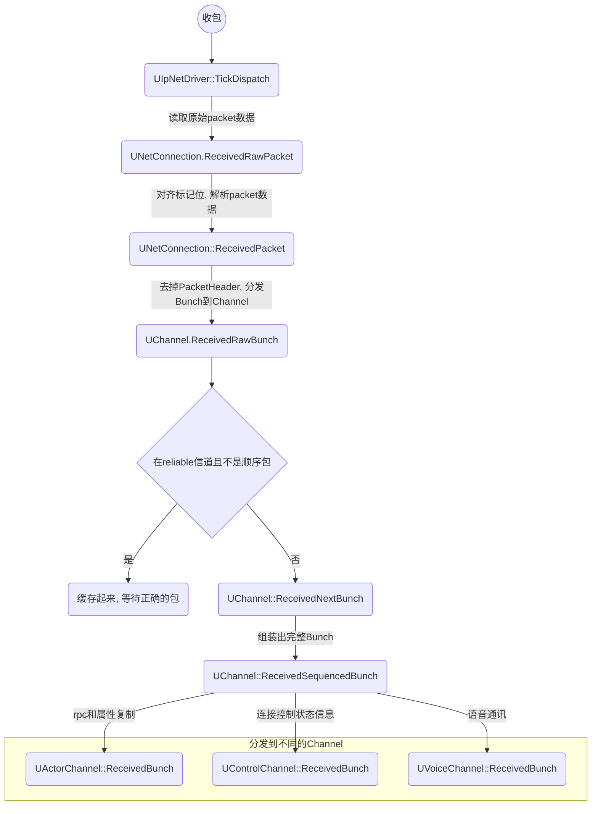

-------
+ 发包

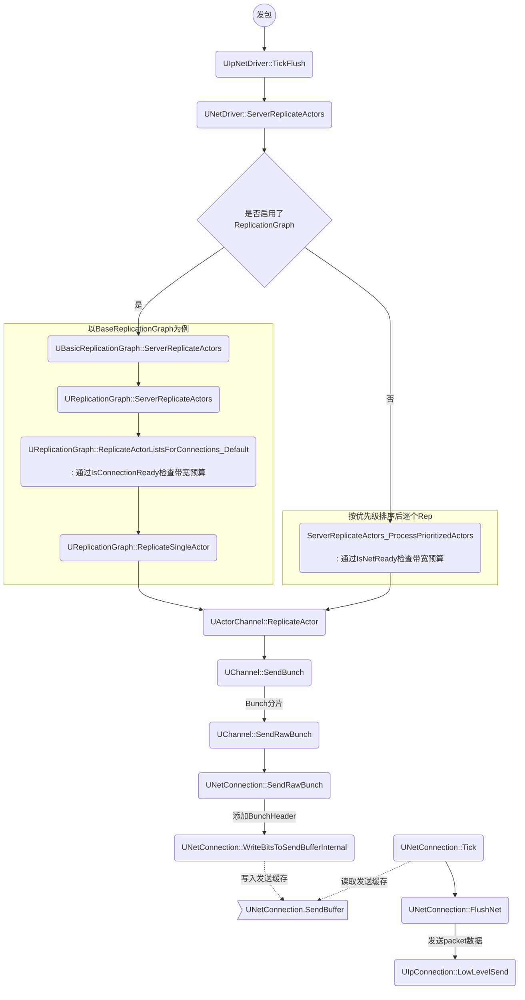

### 3.2 PushModel

​	    replication的性能开销很大一部分，在于需要对所有replicate属性进行属性数据的对比，以确认是否有变化，需要发送到客户端。PushModel机制下属性需要replicate时，由使用者主动置脏（MARK_PROPERTY_DIRTY_FROM_NAME），replication只用关心脏属性的同步。

### 3.3 ReplicationGraph

​	UE针对堡垒之夜里大量的replicate对象造成的性能压力，而提供的一套replicate性能优化框架。

#### 3.3.1 开启使用ReplicationGraph

- 首先要启用插件ReplicationGraph
- 然后有两种方式开启ReplicationGraph

1. 配置
    [/Script/OnlineSubsystemUtils.IpNetDriver]
    ReplicationDriverClassName="/Script/ReplicationGraph.BasicReplicationGraph"

2. 代码里注册
    在UNetDriver::InitBase前注册一下ReplicationGraph

    ```javascript
    UReplicationDriver::CreateReplicationDriverDelegate().BindLambda([](UNetDriver* ForNetDriver, const FURL& URL, UWorld* World) -> UReplicationDriver*
    {
    	return NewObject<UReplicationDriver>(GetTransientPackage(), UReplicationGraph::StaticClass());
    });
    ```

#### 3.3.2 主要的数据结构和接口

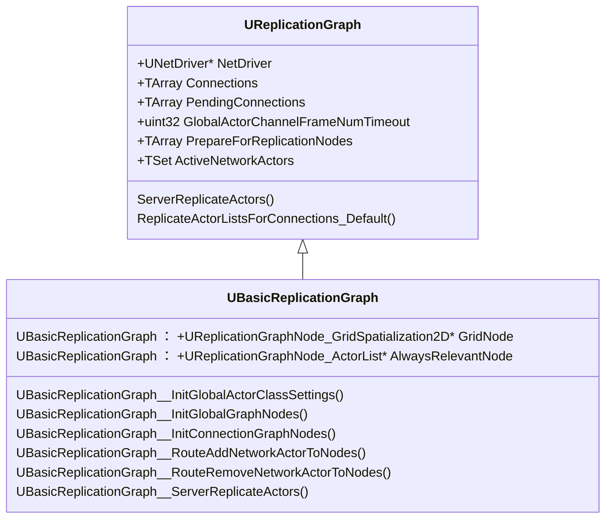
**1、FClassReplicationInfo：**
为每个Actor Class 定义一个，其中包含一组裁剪优化相关默认参数：

- CullDistance：网络裁剪距离
- ReplicationPeriodFrame：复制周期，以帧计数

**2、FGlobalActorReplicationInfoMap：**
所有同步的Actor信息，包含了FGlobalActorReplicationInfo列表和FClassReplicationInfo列表。

**3、FGlobalActorReplicationInfo：**
记录了同步的Actor信息。
成员变量：

- Settings：FClassReplicationInfo类型，记录了Actor类的默认同步设置，如距离、频率等。
- Events: FGlobalActorReplicationEvents类型，FNotifyActorChangeDormancy 休眠状态改变。从休眠列表中添加或删除，从别的列表中删除或添加。
- FConnectionReplicationActorInfo：针对Connection同步Actor信息

**4、UReplicationGraphNode：**
GraphNode基类，包含一些基础接口
NotifyAddNetworkActor / NotifyRemoveNetworkActor：从GraphNode里增删Actor
PrepareForReplication：更新需要同步的Actor
GatherActorListsForConnection：获取针对当前Connection需要同步的Actor列表

**5、UReplicationGraphNode_ActorList：**
UReplicationGraphNode的子类，维护了一组同步Actor，如果Actor位于SubLevel上就记录在StreamingLevelCollection中(以SubLevelName为Key的列表)，否则记录在ReplicationActorList中。

**6、UReplicationGraph::GlobalGraphNodes**

```javascript
	UPROPERTY()
	TArray<UReplicationGraphNode*> GlobalGraphNodes;
```

GridSpatialization2D节点就在这里面

**7、UReplicationGraph::Connections**

​	UNetReplicationGraphConnection是为每个具体连接处理Actor的属性复制。

```javascript
	/** List of connection managers. This list is not sorted and not stable. */
	UPROPERTY()
	TArray<UNetReplicationGraphConnection*> Connections;
```

#### 3.3.3 ReplicationGraph的初始化

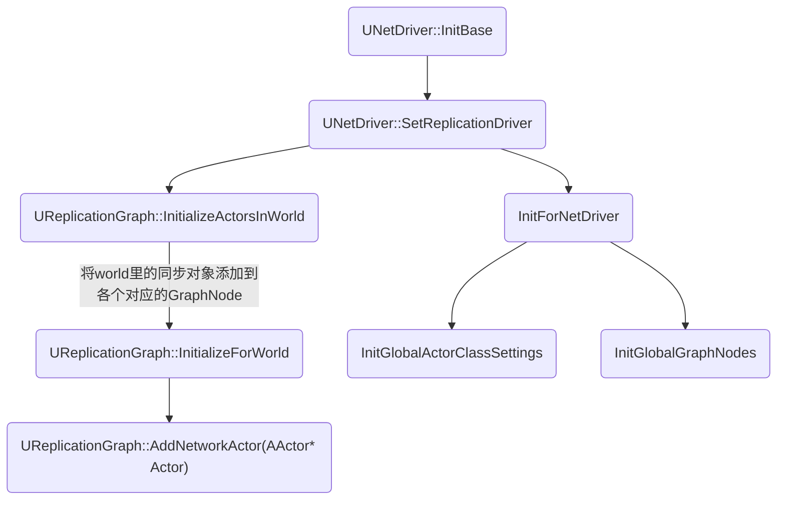


#### 3.3.4 ReplicationGraph的更新流程

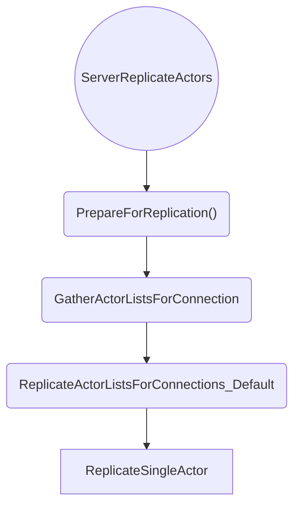

1. 调用GraphNode的PrepareForReplication
    - GridSpatialization2D遍历动态Actor，更新Actor所在格子；
    - AlwaysRelevant记录下来需要同步给所有连接的Actor；
2. 遍历Connections收集ReplicationActorList
      针对每个Connection遍历**GlobalGraphNodes**和**Connection的ConnectionGraphNodes**调用GatherActorListsForConnection，收集需要同步给这个Connection的Actor。
3. ReplicateActorListsForConnections_Default
    对GatheredReplicationListsForConnection里的Actor，检测是否达到同步时间，同步距离，并根据优先级排序(距离，同步时间等因子)，最终对需要同步的Actor调用ReplicateSingleActor
4. 发送Replicate
    对排好序后的Actor列表PrioritizedReplicationList调用ReplicateSingleActor。


### 3.4 属性对比
常规属性对比堆栈：
```text
--UNetDriver.TickFlush()
|--UNetDriver.ServerReplicateActors()
| |--UBaseReplicationGraph::BaseReplicateSingleActor
| | |--UActorChannel.ReplicateActor()
| | | |--FObjectReplicator.ReplicateProperties()
| | | | |--FNetSerializeCB.UpdateChangelistMgr()
| | | | | |--FRepLayout.UpdateChangelistMgr()
| | | | | | |--FRepLayout.CompareProperties()
| | | | | | | |--CompareParentProperties()
| | | | | | | | |--UE4_RepLayout_Private.CompareParentPropertyHelper()
| | | | | | | | | |--CompareParentProperty()
| | | | | | | | | | |--CompareProperties_r()
```


使用了PushModel机制时，根据是否dirty进行筛选：
```text
--UNetDriver.TickFlush()
|--UNetDriver.ServerReplicateActors()
| |--UBaseReplicationGraph::BaseReplicateSingleActor
| | |--UActorChannel.ReplicateActor()
| | | |--FObjectReplicator.ReplicateProperties()
| | | | |--FNetSerializeCB.UpdateChangelistMgr()
| | | | | |--FRepLayout.UpdateChangelistMgr()
| | | | | | |--FRepLayout.CompareProperties()
| | | | | | | |--CompareParentProperties()
| | | | | | | | |--UE4_RepLayout_Private.IsPropertyDirty()
| | | | | | | | | |--SharedParams.PushModelState->IsPropertyDirty(ParentIndex)
```

PushModel重置dirty标记
```text
--UNetDriver.TickFlush()
|--UNetDriver.ServerReplicateActors()
| |--UBaseReplicationGraph::BaseReplicateSingleActor
| | |--UActorChannel.ReplicateActor()
| | | |--FObjectReplicator.ReplicateProperties()
| | | | |--FNetSerializeCB.UpdateChangelistMgr()
| | | | | |--FRepLayout.UpdateChangelistMgr()
| | | | | | |--FRepLayout.CompareProperties()
| | | | | | | |--CompareParentProperties()
| | | | | | | | |--UE4_RepLayout_Private.IsPropertyDirty()
| | | | | | | | | |--SharedParams.PushModelState->IsPropertyDirty(ParentIndex)
| | | | | | | | |--SharedParams.PushModelState->ResetDirtyStates();
```


### 3.5 SubObject的属性复制

ReplicateSubobjects接口提供了让任意UObject类型具备属性复制的能力

#### 3.5.1 AActor::ReplicateSubobjects

```c++
bool AActor::ReplicateSubobjects(UActorChannel *Channel, FOutBunch *Bunch, FReplicationFlags *RepFlags)
{
	check(Channel);
	check(Bunch);
	check(RepFlags);
	bool WroteSomething = false;	
	for (UActorComponent* ActorComp : ReplicatedComponents)
	{
		if (ActorComp && ActorComp->GetIsReplicated())
		{
			WroteSomething |= ActorComp->ReplicateSubobjects(Channel, Bunch, RepFlags);		// Lets the component add subobjects before replicating its own properties.
			WroteSomething |= Channel->ReplicateSubobject(ActorComp, *Bunch, *RepFlags);	// (this makes those subobjects 'supported', and from here on those objects may have reference replicated)
		}
	}
	return WroteSomething;
}
```


#### 3.5.2 使用Replicated SubObjects List（UE5）

UE5.1加入的”**Registered Subobjects List**“，可以平替掉AActor::ReplicateSubobjects接口，优化Subobject的属性复制性能。

```c++
// bReplicateUsingRegisteredSubObjectList：Actor和ActorComponent都有这个开关
/**
* When true the replication system will only replicate the registered subobjects list
* When false the replication system will instead call the virtual ReplicateSubObjects() function where the subobjects need to be manually replicated.
*/
UPROPERTY(Config, EditDefaultsOnly, BlueprintReadOnly, Category=Replication, AdvancedDisplay)
uint8 bReplicateUsingRegisteredSubObjectList : 1;
```

+ 配置开关

bool GDefaultUseSubObjectReplicationList = false;
static FAutoConsoleVariableRef CVarDefaultUseSubObjectReplicationList(
	TEXT("net.SubObjects.DefaultUseSubObjectReplicationList"),
	GDefaultUseSubObjectReplicationList,
	TEXT("Do actors and actorcomponents replicate subobjects using the registration method by default."));

+ 使用步骤

1. Set bReplicateUsingRegisteredSubObjectList = true for the Actor or ActorComponent.
2. Call `AddReplicatedSubObject` in `ReadyForReplication, BeginPlay`, or when creating a new subobject. (`ReadyForReplication` is called between `InitComponent` and `BeginPlay`, and registering a component here allows it to call RPCs early inside of the component’s `BeginPlay`.)
3. `Call RemoveReplicatedSubObject` when modifying or deleting a subobject. (This step is very important, as unless the reference is removed, the list will still reference the pointer of a subobject that has been changed or marked for destruction, causing a crash when the object is garbage collected.)

### 3.6 引用类型对象的网络复制

+ UObject::IsSupportedForNetworking()   判断UObject对象是否可以被网络复制

+ 可网络复制的引用对象的类型规则：

    + 任意的开启了Replicate的AActor、UActorComponent类型引用均可被网络复制

    + 名字稳定一致的UObject类型引用，需要加载自Packeage才可被网络复制

+ Stably Named Objects

    Stably named objects are simply objects that will exist on both the server and the client, and have exactly the same name.

    Actors are stably named if they were loaded directly from packages (not spawned during gameplay).

### 3.7 FastArray同步

​		Replication属性为TArray数组的情况下，TArray可能有增、删、改等操作，即使只同步有变化的数据元素，但是对于数组元素Remove情况下，由于是连续的存储容器，在Remove中间元素时，后面的全部元素的索引都发生了改变，那么TArray也会同步Remove Index之后的全部数据，可能需要占据较大流量和带宽。因此针对这个问题，可以采用以下几点解决方案：

1. 采用固定数组方式，不改变数组长度，只同步需要同步的Item以及Item索引。
2. 使RemoveAtSwap去移除，这样可以大幅减少同步量，但是数组元素顺序无法得到保证，需要有额外处理才知道增删改了哪个Item，GameplayTasksComponent就是采用这种方式移除模拟端的Task，需要模拟端额外缓存一份列表确定哪个Item增加或删除。
3. 使用FastArray去更高效去同步数组元素。FastArray本质是一个继承自FFastArraySerializer结构体，TArray定义在这个结构体。该结构体必须包含一个 NetDeltaSerialize函数。需要将TArray数组的元素继承自FFastArraySerializerItem。改结构体在TStructOpsTypeTraits中具有WithNetDeltaSerializer=true的声明。最后为TArray字段标记UPROPERTY，并将属性名改为Items。


FastArray优点：

1. 对于大规模动态数组，只同步有修改或删除的元素，可以有效减少数据对比与同步带宽。
2. 原生的Item元素增删改事件，方便业务逻辑扩展。
3. MarkDirty方式触发同步，避免不必要的数据比对（类似PushMode）

FastArray缺点：

1. 需要同步数据元素以外的增删改信息（ReplicationID、NumChanged、DeletedIndices等）
2. 差异化比较中，需要更多的CPU消耗去处理数据比对。
3. 创建一个FastArray需要指定积累，对比普通数据结构略微繁琐，并且只支持C++定义，不支持蓝图。
4. 通过ReplicationID指定Item，不在意Item的Index，所以是无序的，也没有去保证客户端与服务器之间的顺序一致。


## 4. 网络流量控制

### 4.1 发送速率

#### 4.1.1 当前发送速率

每个UNetConnection有一个数据发送速率`CurrentNetSpeed`，表示每秒钟可以发送多少字节数据

#### 4.1.2 UE4的发送速率配置

DefaultEngine.ini

- 最大速率
- [/Script/OnlineSubsystemUtils.IpNetDriver]
    MaxClientRate=100000
    MaxInternetClientRate=100000 // 非局域网条件下的MaxClientRate配置
- 实际速率`CurrentNetSpeed`
- [/Script/Engine.Player]
    ConfiguredInternetSpeed=100000
    ConfiguredLanSpeed=100000
- 实际速率受最大速率限制，最小为1800
- 这是单个UNetConnection的总的发送字节数配置
- 客户端、ds端的发送速率都由这些配置决定

### 4.2 带宽预算

- 发送数据，每个UNetConnection有带宽预算`UNetConnection.QueuedBits`，小于0，表示这一帧还可以发送多少bit数据
- **带宽预算**受到**发送速率**的影响

#### 4.2.1 带宽预算的分配和消耗

UNetConnection::Tick里根据CurrentNetSpeed计算分配当前的带宽预算，由于预算可以累积，为了避免过多的预算可能导致下一帧发送太多数据，预算钳制在两倍范围内

```c++
void UNetConnection::Tick(float DeltaSeconds)
{
	...
	float DeltaBits = CurrentNetSpeed * BandwidthDeltaTime * 8.f;
	QueuedBits -= FMath::TruncToInt(DeltaBits);
	float AllowedLag = 2.f * DeltaBits;
	if (QueuedBits < -AllowedLag)
	{
		QueuedBits = FMath::TruncToInt(-AllowedLag);
	}
}
```

UNetConnection::FlushNet里面，发送了多少数据，会消耗掉预算

```c++
void UNetConnection::FlushNet(bool bIgnoreSimulation)
{
	...
	QueuedBits += (PacketBytes * 8);
}
```

#### 4.2.2 带宽预算检查

- 有ReplicationGraph时，通过UReplicationGraph::IsConnectionReady检查带宽预算
    - 可以通过命令`Net.RepGraph.DisableBandwithLimit 1`动态关闭预算检查，任性地使用网络流量带宽
- 没有ReplicationGraph时，通过UNetConnection::IsNetReady检查带宽预算
    - 可以通过命令`net.DisableBandwithThrottling 1`动态关闭预算检查，不限制地使用网络流量带宽（非shipping版本有效）

### 4.3 可靠RPC的吞吐量限制

**UChannel::NumOutRec**：ActorChannel里面已发送但还没有收到Ack确认的Bunch数量。

NumOutRec的上限值：enum { RELIABLE_BUFFER = 256 }

NumOutRec的变化:

+ UChannel::ReceivedAcks里面会NumOutRec--；

+ UChannel::PrepBunch里面对可靠的FOutBunch，会NumOutRec++；


判断是否超过上限

```c++
FOutBunch::FOutBunch( UChannel* InChannel, bool bInClose )
:	FNetBitWriter	( InChannel->Connection->PackageMap, InChannel->Connection->GetMaxSingleBunchSizeBits())
,	Next		( nullptr )
,	Channel		( InChannel )
,	Time		( 0 )
,	ChIndex		( InChannel->ChIndex )
,	ChName		( InChannel->ChName )
,	ChSequence	( 0 )
,	PacketId	( 0 )
,	ReceivedAck	( 0 )
,	bOpen		( 0 )
,	bClose		( bInClose )
,	bIsReplicationPaused	( 0 )
,	bReliable	( 0 )
,	bPartial	( 0 )
,	bPartialInitial			( 0 )
,	bPartialFinal			( 0 )
,	bHasPackageMapExports	( 0 )
,	bHasMustBeMappedGUIDs	( 0 )
,	CloseReason( EChannelCloseReason::Destroyed )
{
	checkSlow(!Channel->Closing);
	checkSlow(Channel->Connection->Channels[Channel->ChIndex]==Channel);

	// Match the byte swapping settings of the connection
	SetByteSwapping(Channel->Connection->bNeedsByteSwapping);

	// Reserve channel and set bunch info.
	if( Channel->NumOutRec >= RELIABLE_BUFFER-1+bClose )
	{
		SetOverflowed(-1);
		return;
	}
}
```

```c++
int32 UChannel::IsNetReady( bool Saturate )
{
	// If saturation allowed, ignore queued byte count.
	if( NumOutRec>=RELIABLE_BUFFER-1 )
	{
		return 0;
	}
	return Connection->IsNetReady( Saturate );
}
```


### 4.4 网络流量优化

+ 减小发送频次

    + 非必要不开bReplicates
    + 按距离降频：NetUpdateFrequency、NetCullDistanceSquared
    + 相关性裁剪

+ 减小网络包的Size

    + 浮点数量化：

        + 数据绝对值越小，量化后占用bit数越小
        + 常见数据的量化压缩：FVector_NetQuantize、FVector_NetQuantize10、FVector_NetQuantize100、FVector_NetQuantizeNormal
        + 

    + 自定义序列化：给自定义的数据结构，增加自定义的网络序列化接口，可以参考使用TStructOpsTypeTraits类模板继承TStructOpsTypeTraitsBase2，来指定。

    + 自定义序列化后，结构体里的所有字段将作为一个整体一起replicate。

    + ```c++
        template<>
        struct TStructOpsTypeTraits<YourStructType> : public TStructOpsTypeTraitsBase2<YourStructType>
        {
        	enum
        	{
        		WithNetSerializer = true,         // 指定自定义的NetSerialize接口
        		WithIdenticalViaEquality = true,  // 指定自定义的==接口，否则默认按逐个属性比较反射数据
        	};
        };
        ```

    

## 5. UE4的RPC和Replication的时序可靠性

1. **reliable RPC能保证调用次序与执行次序一致吗？**
    同一个Actor的reliable RPC间可以保证一致，不同Actor的reliable RPC之间不保证。
2. **property replication能保证ds端修改次序与客户端RepNotify次序一致吗？**
    不能保证时序：即使是同一个Actor的同一个Component里，RepNotify回调的执行顺序依赖property在编译时定义的顺序，甚至可能后续实现有变化，所以强烈建议不要依赖这个顺序。
3. **property在server端的每一次变化，都会被replication到客户端吗？**
    不会：replication的间隔时间内发生的多次变化，只有最后的值会被拿去与上一次replication的值做对比，有改变才会发到客户端。
4. **property发生变化后，发送replication的那个网络包丢失了，然后server端这个property没有再发生变化的话，最后一次的值是否会被replication到客户端？**
    会：首次replication发包的bunch是reliable的（见UActorChannel::ReplicateActor & UActorChannel::ReplicateSubobject），而后续的是unreliable的。

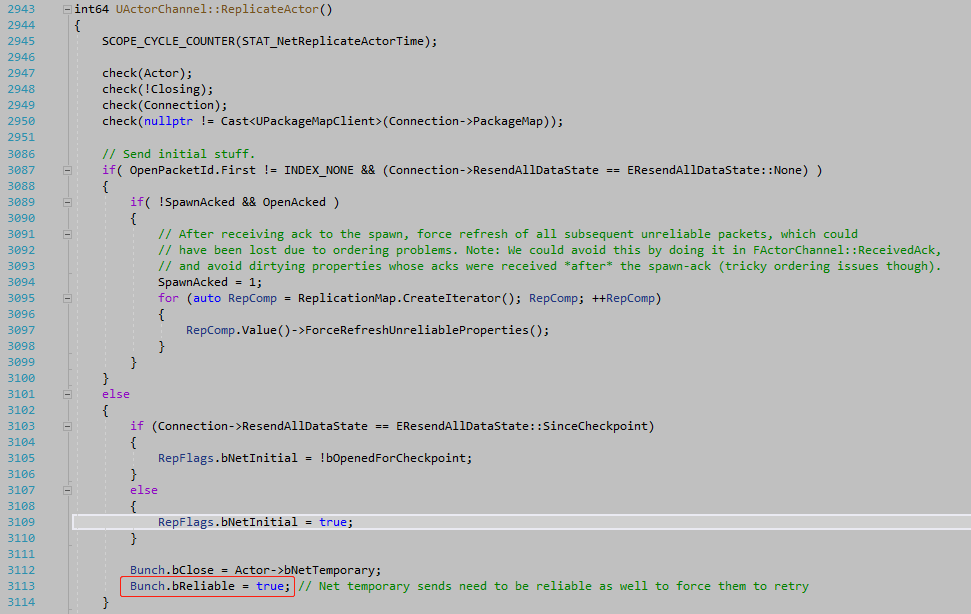

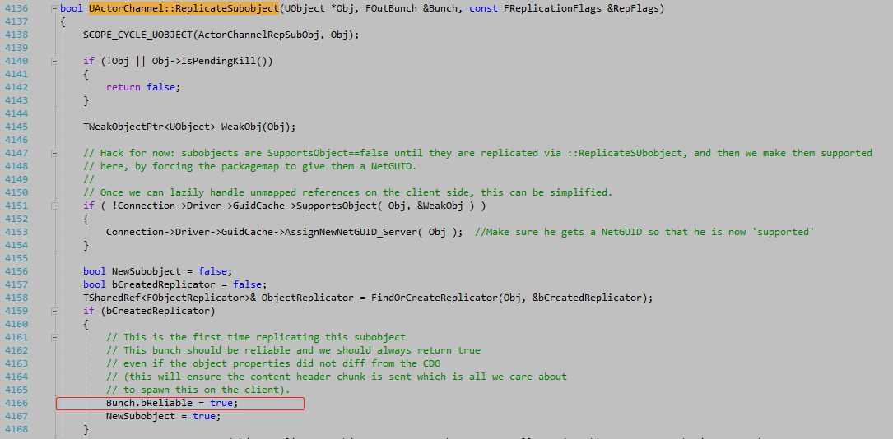
        如果bunch实际有丢包的话，ds会根据收包序号检测到发生了丢包（见FNetPacketNotify::ProcessReceivedAcks），触发UNetConnection::ReceivedNak，ds端会根据丢包的PackageID在FSendingRepState中的ChangeHistory做上标记（见FObjectReplicator::ReceivedNak），这样下一次做属性同步的时候，就能再次将丢包中包含的属性数据再次填入bunch包中发送（见FRepLayout::UpdateChangelistHistory）。

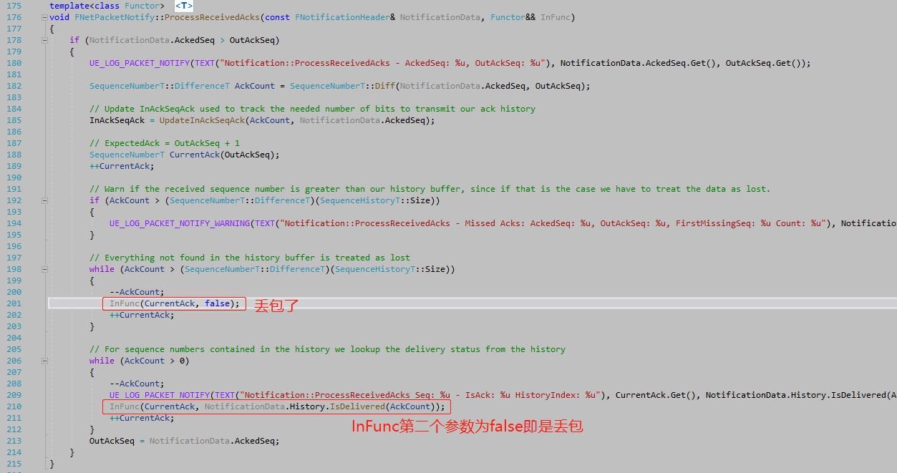

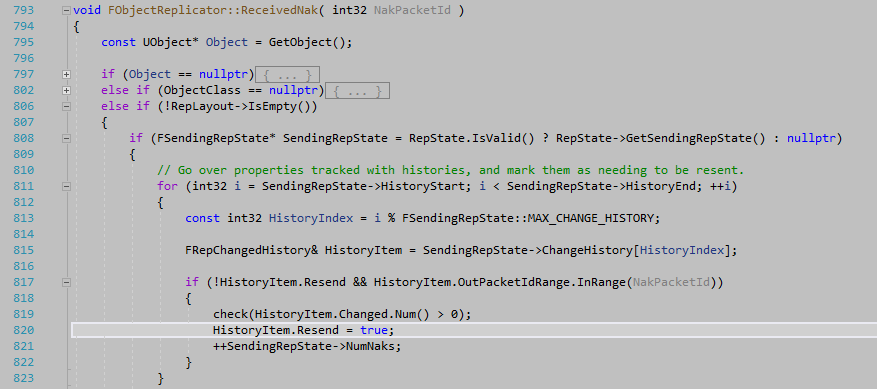

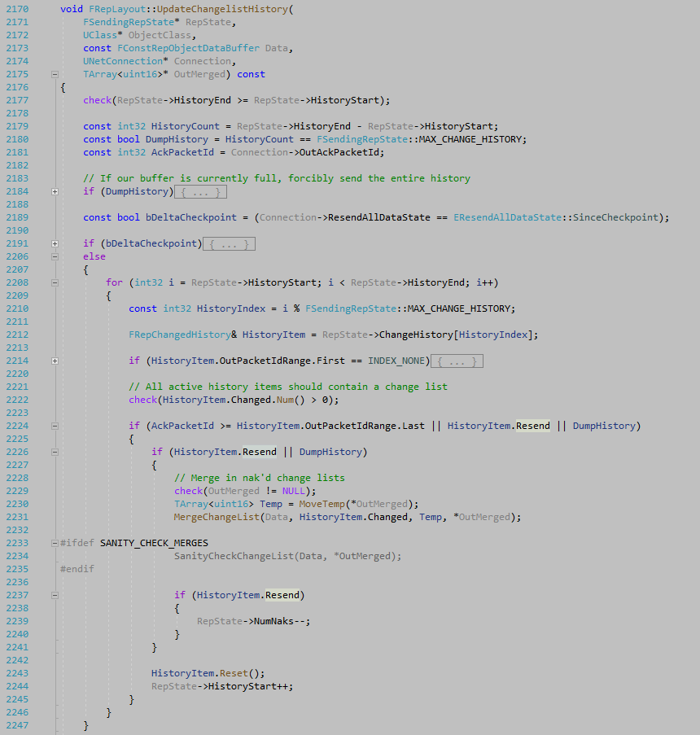


## 6. UE4的移动同步

### 6.1 基本的状态同步框架

UE4的状态同步实现比较复杂，涉及同步包合并，BaseMovement，RootMotion，物理同步等等，先抛开这些梳理下基本的状态同步框架

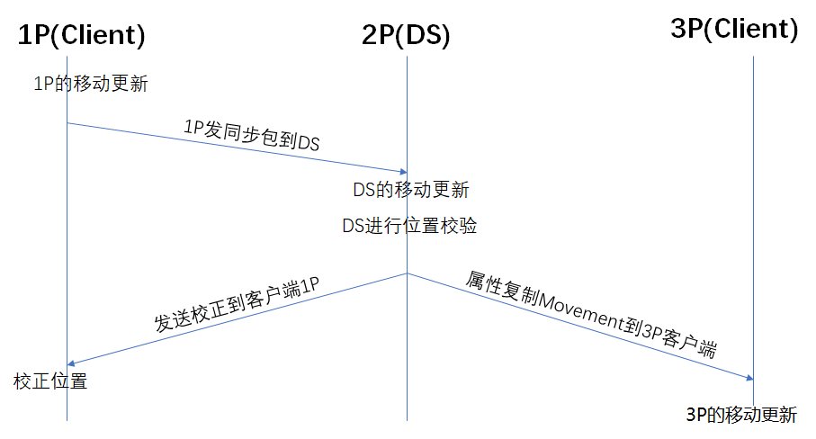

+ 1P的移动更新：PerformMovement -> StartNewPhysics -> PhysWalking
+ DS的移动更新：ServerMove_Implementation / ServerMovePacked_ServerReceive
+ 1P发同步包到DS：ReplicateMoveToServer -> CallServerMove
+ DS进行位置校验：ServerMoveHandleClientError
+ DS发送校正到客户端1P：SendClientAdjustment
+ 客户端校正：
    + 无需校正: ClientAckGoodMove_Implementation
    + 校正情况: ClientAdjustPosition_Implementation
+ 3P的移动更新：
    + 3P的常规更新： SimulatedTick / SimulateMovement
    + 收移动同步包：AActor::OnRep_ReplicatedMovement
    + 位置和朝向的更新：ACharacter::PostNetReceiveLocationAndRotation
    + 移动速度的更新：APawn::PostNetReceiveVelocity


#### 6.1.1 移动同步包的数据结构

+ 上行同步包：FCharacterNetworkMoveData
    + 移动同步包的基本数据包括：时间戳、位置、朝向、移动的加速度、MovementMode、Base相关（注：没有同步速度）
    + 需要修改定制移动同步包时，就要从它继承，实现下ClientFillNetworkMoveData()和Serialize()

```c++
struct FCharacterNetworkMoveData
{
    ......
  	//------------------------------------------------------------------------
	// Basic movement data.

	float TimeStamp;
	FVector_NetQuantize10 Acceleration;
	FVector_NetQuantize100 Location;		// Either world location or relative to MovementBase if that is set.
	FRotator ControlRotation;
	uint8 CompressedMoveFlags;

	class UPrimitiveComponent* MovementBase;
	FName MovementBaseBoneName;
	uint8 MovementMode;
};
```

+ 下行同步包：FRepMovement

    ```c++
    struct FRepMovement
    {    
        FVector LinearVelocity;
        FVector AngularVelocity;
        FVector Location;
        FRotator Rotation;
        uint8 bSimulatedPhysicSleep : 1;
        uint8 bRepPhysics : 1;
    };
    ```

+ FNetworkPredictionData_Client_Character
  
    + SavedMoves：FSavedMove_Character类型的有序队列，记录发送过的移动同步包数据，按时间戳有序，一旦被DS的Ack回包确认过后，同步包就会从队列里移除。如果发生拉扯，则会从此队列里取出数据回滚执行移动更新。


#### 6.1.2 DS端角色的移动更新

+ DS端角色收包后，则立即进行移动更新

```c++
--ACharacter::ServerMovePacked_Implementation
|--UCharacterMovementComponent::ServerMovePacked_ServerReceive
| |--UCharacterMovementComponent::ServerMove_HandleMoveData
| | |--UCharacterMovementComponent::ServerMove_PerformMovement
| | | |--UCharacterMovementComponent::MoveAutonomous
| | | | |--UCharacterMovementComponent::PerformMovement
```

+ 速度的更新：跟客户端1P一样，通过加速度，结合阻尼、速度衰减来计算当前的移动速度

```c++
--UCharacterMovementComponent::PerformMovement
|--UCharacterMovementComponent::StartNewPhysics
| |--UCharacterMovementComponent::PhysWalking
| | |--UCharacterMovementComponent::CalcVelocity
```

+ ServerMove_PerformMovement

    主要做了三件事：

    + 检查时间戳差异
    + 实际移动更新
    + 检查位置差，判定是否拉扯

```c++
void UCharacterMovementComponent::ServerMove_PerformMovement(const FCharacterNetworkMoveData& MoveData)
{

    ......

	FNetworkPredictionData_Server_Character* ServerData = GetPredictionData_Server_Character();
	check(ServerData);
	// 检查时间戳差异，过大则丢弃！
	if( !VerifyClientTimeStamp(ClientTimeStamp, *ServerData) )
	{
		const float ServerTimeStamp = ServerData->CurrentClientTimeStamp;
		// This is more severe if the timestamp has a large discrepancy and hasn't been recently reset.
		if (ServerTimeStamp > 1.0f && FMath::Abs(ServerTimeStamp - ClientTimeStamp) > CharacterMovementCVars::NetServerMoveTimestampExpiredWarningThreshold)
		{
			UE_LOG(LogNetPlayerMovement, Warning, TEXT("ServerMove: TimeStamp expired: %f, CurrentTimeStamp: %f, Character: %s"), ClientTimeStamp, ServerTimeStamp, *GetNameSafe(CharacterOwner));
		}
		else
		{
			UE_LOG(LogNetPlayerMovement, Log, TEXT("ServerMove: TimeStamp expired: %f, CurrentTimeStamp: %f, Character: %s"), ClientTimeStamp, ServerTimeStamp, *GetNameSafe(CharacterOwner));
		}		
		return;
	}

	......

	if (DeltaTime > 0.f)
	{
		ServerData->CurrentClientTimeStamp = ClientTimeStamp;
		ServerData->ServerAccumulatedClientTimeStamp += DeltaTime;
		ServerData->ServerTimeStamp = MyWorld->GetTimeSeconds();
		ServerData->ServerTimeStampLastServerMove = ServerData->ServerTimeStamp;

		......
		// 实际的角色移动：会调用PerformMovement
        MoveAutonomous(ClientTimeStamp, DeltaTime, ClientMoveFlags, ClientAccel);
	}

    // 对比位置差异，进行“拉扯”判定
	// Validate move only after old and first dual portion, after all moves are completed.
	if (MoveData.NetworkMoveType == FCharacterNetworkMoveData::ENetworkMoveType::NewMove)
	{
		ServerMoveHandleClientError(ClientTimeStamp, DeltaTime, ClientAccel, MoveData.Location, MoveData.MovementBase, MoveData.MovementBaseBoneName, MoveData.MovementMode);
	}
}
```


#### 6.1.3 DS给客户端1P的回包（Ack或拉扯）

```c++
// 最终在replication系统中通过PlayerController调用SendClientAdjustment
void UCharacterMovementComponent::SendClientAdjustment()
{
	if (!HasValidData())
	{
		return;
	}

	FNetworkPredictionData_Server_Character* ServerData = GetPredictionData_Server_Character();
	check(ServerData);

	if (ServerData->PendingAdjustment.TimeStamp <= 0.f)
	{
		return;
	}

	const float CurrentTime = GetWorld()->GetTimeSeconds();
	if (ServerData->PendingAdjustment.bAckGoodMove)
	{
        // 回包给客户端，确认移动包已被DS接受确认
		// just notify client this move was received
		if (CurrentTime - ServerLastClientGoodMoveAckTime > NetworkMinTimeBetweenClientAckGoodMoves)
		{
			ServerLastClientGoodMoveAckTime = CurrentTime;
			if (ShouldUsePackedMovementRPCs())
			{
				ServerSendMoveResponse(ServerData->PendingAdjustment);
			}
			else
			{
				ClientAckGoodMove(ServerData->PendingAdjustment.TimeStamp);
			}
		}
	}
	else
    {
        // “发送拉扯”
        ......
    }
    ...
}
```

#### 6.1.4 “拉扯”在DS端的判定

DS端的移动更新UCharacterMovementComponent::ServerMove_PerformMovement，最后会调用ServerMoveHandleClientError来判定是否拉扯，ServerData->PendingAdjustment.bAckGoodMove记录这个判定结果。然后在UCharacterMovementComponent::SendClientAdjustment中发送回包。

```c++
void UCharacterMovementComponent::ServerMoveHandleClientError(
    float ClientTimeStamp, float DeltaTime, 
    const FVector& Accel, const FVector& RelativeClientLoc, 
    UPrimitiveComponent* ClientMovementBase, 
    FName ClientBaseBoneName, uint8 ClientMovementMode)
{
    ......
    // RelativeClientLoc如果是相对位置的话，先用DS端的MovementBaseUtility::GetMovementBaseTransform转为world位置
	// Offset may be relative to base component
	FVector ClientLoc = RelativeClientLoc;
	if (MovementBaseUtility::UseRelativeLocation(ClientMovementBase))
	{
		FVector BaseLocation;
		FQuat BaseRotation;
		MovementBaseUtility::GetMovementBaseTransform(ClientMovementBase, ClientBaseBoneName, BaseLocation, BaseRotation);
		ClientLoc += BaseLocation;
	}
	else
	{
		ClientLoc = FRepMovement::RebaseOntoLocalOrigin(ClientLoc, this);
	}

	// Compute the client error from the server's position
	// If client has accumulated a noticeable positional error, correct them.
	bNetworkLargeClientCorrection = ServerData->bForceClientUpdate;
	if (ServerData->bForceClientUpdate || ServerCheckClientError(ClientTimeStamp, DeltaTime, Accel, ClientLoc, RelativeClientLoc, ClientMovementBase, ClientBaseBoneName, ClientMovementMode))
	{
        ......
		// 填充拉扯数据包，设置ServerData->PendingAdjustment.bAckGoodMove = false
    }
    else
    {
        // 如果开启了bServerAcceptClientAuthoritativePosition的话，就用客户端的位置，消除同步误差。
    }
}
```


拉扯判定条件：

1. MovementMode不一致
2. 位置差大于AGameNetworkManager::MAXPOSITIONERRORSQUARED
3. 位置差大于UCharacterMovementComponent::NetworkLargeClientCorrectionDistance

判定为拉扯时，会置ServerData->PendingAdjustment.bAckGoodMove = false，上面的条件1或者3满足时会置bNetworkLargeClientCorrection=true，表示同步差异很大，会更快地发送拉扯包到客户端（具有更小的发送拉扯的CD间隔时间）。

```c++
bool UCharacterMovementComponent::ServerExceedsAllowablePositionError(
    float ClientTimeStamp,
    float DeltaTime,
    const FVector& Accel,
    const FVector& ClientWorldLocation,
    const FVector& RelativeClientLocation,
    UPrimitiveComponent* ClientMovementBase,
    FName ClientBaseBoneName, uint8 ClientMovementMode)
{
	// Check for disagreement in movement mode
	const uint8 CurrentPackedMovementMode = PackNetworkMovementMode();
	if (CurrentPackedMovementMode != ClientMovementMode)
	{
		// Consider this a major correction, see SendClientAdjustment()
		bNetworkLargeClientCorrection = true;
		return true;
	}

    // 计算客户端与DS的位置差LocDiff 
    // ClientWorldLocation: 客户端上报的同步包里的位置(如果是相对位置的话会先用DS端的MovementBaseUtility::GetMovementBaseTransform转为world位置)
    // UpdatedComponent->GetComponentLocation()：DS端用最新同步包进行了ServerMove更新后的位置
	const FVector LocDiff = UpdatedComponent->GetComponentLocation() - ClientWorldLocation;	
	const AGameNetworkManager* GameNetworkManager = (const AGameNetworkManager*)(AGameNetworkManager::StaticClass()->GetDefaultObject());
	if (GameNetworkManager->ExceedsAllowablePositionError(LocDiff))
	{
		bNetworkLargeClientCorrection |= (LocDiff.SizeSquared() > FMath::Square(NetworkLargeClientCorrectionDistance));
		return true;
	}

	return false;
}

```

#### 6.1.5 “拉扯”在客户端的实现

“拉扯”主要做几个事情：

1. 从SavedMoves里查找最后一个已被DS接受的同步包。
2. 移除已经被DS认可的移动包。
3. 拉扯客户端1P到DS的位置，回滚状态到DS的状态。
4. 设置ClientData->bUpdatePosition=true，然后在TickComponent更新时，先调用ClientUpdatePositionAfterServerUpdate，把SavedMoves里的尚未被DS确认的同步包逐个执行一遍移动更新，再恢复正常的移动更新。

```c++
void UCharacterMovementComponent::ClientAdjustPosition_Implementation
	(
	float TimeStamp,
	FVector NewLocation,
	FVector NewVelocity,
	UPrimitiveComponent* NewBase,
	FName NewBaseBoneName,
	bool bHasBase,
	bool bBaseRelativePosition,
	uint8 ServerMovementMode
	)
{
    // 处理玩家在移动台上的情形：客户端和ds是否都在同一个移动台上
	// Make sure the base actor exists on this client.
	const bool bUnresolvedBase = bHasBase && (NewBase == NULL);
	if (bUnresolvedBase)
	{
		if (bBaseRelativePosition)
		{
			UE_LOG(LogNetPlayerMovement, Warning, TEXT("ClientAdjustPosition_Implementation could not resolve the new relative movement base actor, ignoring server correction! Client currently at world location %s on base %s"),
				*UpdatedComponent->GetComponentLocation().ToString(), *GetNameSafe(GetMovementBase()));
			return;
		}
		else
		{
			UE_LOG(LogNetPlayerMovement, Verbose, TEXT("ClientAdjustPosition_Implementation could not resolve the new absolute movement base actor, but WILL use the position!"));
		}
	}
	
    // 1: 根据时间戳查找最后一个已经被DS认可的移动包
	// Ack move if it has not expired.
	int32 MoveIndex = ClientData->GetSavedMoveIndex(TimeStamp);

    ......
    
    // 2: 移除已经被DS认可的移动包
	ClientData->AckMove(MoveIndex, *this);	

	// 3：拉扯客户端1P到DS的位置
	// Trust the server's positioning.
	if (UpdatedComponent)
	{
		UpdatedComponent->SetWorldLocation(WorldShiftedNewLocation, false, nullptr, ETeleportType::TeleportPhysics);
	}
	Velocity = NewVelocity;

    ......
    // 4: 标记拉扯后等待更新
	ClientData->bUpdatePosition = true;
}
```


```c++
bool UCharacterMovementComponent::ClientUpdatePositionAfterServerUpdate()
{

	.......
	// 4：把SavedMoves里的剩余同步包，按顺序逐个执行一遍移动更新。
	// Replay moves that have not yet been acked.
	UE_LOG(LogNetPlayerMovement, Verbose, TEXT("ClientUpdatePositionAfterServerUpdate Replaying %d Moves, starting at Timestamp %f"), ClientData->SavedMoves.Num(), ClientData->SavedMoves[0]->TimeStamp);
	for (int32 i=0; i<ClientData->SavedMoves.Num(); i++)
	{
		FSavedMove_Character* const CurrentMove = ClientData->SavedMoves[i].Get();
		checkSlow(CurrentMove != nullptr);
		CurrentMove->PrepMoveFor(CharacterOwner);

		if (ShouldUsePackedMovementRPCs())
		{
			// Make current move data accessible to MoveAutonomous or any other functions that might need it.
			if (FCharacterNetworkMoveData* NewMove = GetNetworkMoveDataContainer().GetNewMoveData())
			{
				SetCurrentNetworkMoveData(NewMove);
				NewMove->ClientFillNetworkMoveData(*CurrentMove, FCharacterNetworkMoveData::ENetworkMoveType::NewMove);
			}
		}

		MoveAutonomous(CurrentMove->TimeStamp, CurrentMove->DeltaTime, CurrentMove->GetCompressedFlags(), CurrentMove->Acceleration);

		CurrentMove->PostUpdate(CharacterOwner, FSavedMove_Character::PostUpdate_Replay);
		SetCurrentNetworkMoveData(nullptr);
	}

	......
	
	return (ClientData->SavedMoves.Num() > 0);
}

```


####  6.1.6 DS发送同步数据给客户端3P角色

DS发送同步数据给客户端3P角色，是通过属性复制完成的。

```c++
/** Used for replication of our RootComponent's position and velocity */
UPROPERTY(EditDefaultsOnly, ReplicatedUsing=OnRep_ReplicatedMovement, Category=Replication, AdvancedDisplay)
struct FRepMovement ReplicatedMovement;
```
```c++
/** Fills ReplicatedMovement property */
ENGINE_API virtual void GatherCurrentMovement();
```

在属性复制前的AActor::PreReplication调用中，通过GatherCurrentMovement填充同步数据。


#### 6.1.7 客户端3P角色的移动更新

+ **3P的Tick更新**：没有收到同步包时的tick帧内的移动预测更新，同时处理角色触地检测，贴地移动，BaseMovement，移动平滑等。

```c++
--UCharacterMovementComponent::TickComponent
|--UCharacterMovementComponent::SimulatedTick
| |--UCharacterMovementComponent::SimulateMovement
| | |--UCharacterMovementComponent::MoveSmooth		     // 这里更新胶囊体移动
| |--UCharacterMovementComponent::SmoothClientPosition   // 这里处理Mesh的移动平滑性
```


**角色碰撞穿插问题**

SafeMoveUpdatedComponent：通过调用UCharacterMovementComponent::ResolvePenetrationImpl处理角色碰撞穿插问题。


```c++
void UCharacterMovementComponent::MoveSmooth(const FVector& InVelocity, const float DeltaSeconds, FStepDownResult* OutStepDownResult)
{
	...
	FVector Delta = InVelocity * DeltaSeconds;
	if (Delta.IsZero())
	{
		return;
	}

	FScopedMovementUpdate ScopedMovementUpdate(UpdatedComponent, bEnableScopedMovementUpdates ? EScopedUpdate::DeferredUpdates : EScopedUpdate::ImmediateUpdates);

	if (IsMovingOnGround())
	{
		MoveAlongFloor(InVelocity, DeltaSeconds, OutStepDownResult); // 也会调进SafeMoveUpdatedComponent
	}
	else
	{
		FHitResult Hit(1.f);
		SafeMoveUpdatedComponent(Delta, UpdatedComponent->GetComponentQuat(), true, Hit);
	...	
}		

```
```c++
// bNetworkSmoothingComplete: 表示Mesh平滑追赶胶囊体是否已经完成，这时ClientPredictionData的MeshTranslationOffset和MeshRotationOffset是零
void UCharacterMovementComponent::SmoothClientPosition(float DeltaSeconds)
{
	if (!HasValidData() || NetworkSmoothingMode == ENetworkSmoothingMode::Disabled)
	{
		return;
	}

	......

	SmoothClientPosition_Interpolate(DeltaSeconds);  // 更新ClientPredictionData，插值计算Mesh相对于胶囊体的偏移信息
	SmoothClientPosition_UpdateVisuals();			 // 更新Mesh的位置、朝向
}
```

3P角色的移动平滑性：**胶囊体和Mesh的移动是分别更新的**

分三种平滑模式ENetworkSmoothingMode

1. Disabled：无平滑
2. Linear：线性平滑
3. Exponential：指数平滑


+ **收到同步包时的移动更新**：

​		OnRep_ReplicatedMovement里设置3P的速度和位置朝向。UCharacterMovementComponent设置速度，胶囊体直接设置速度（FPhysicsPredictionSettings::bEnablePhysicsPrediction开启时）；位置朝向的更新会一路调用到UCharacterMovementComponent::SmoothCorrection，**直接设置UpdatedComponent即胶囊体的位置和朝向**。并计算Mesh相对于胶囊体的偏移信息和时间戳等存入**ClientPredictionData**

```c++
--ACharacter::OnRep_ReplicatedMovement
|--AActor::OnRep_ReplicatedMovement
| |--APawn::PostNetReceiveVelocity
| |--ACharacter::PostNetReceiveLocationAndRotation
| | |--UCharacterMovementComponent::SmoothCorrection
| | | |--USceneComponent::SetWorldLocationAndRotation
| | | | |--USceneComponent::SetRelativeLocationAndRotation
| | | | | |--UPrimitiveComponent::MoveComponentImpl
```


### 6.2 移动同步的一些设置

+ 移动同步DebugDraw：p.NetVisualizeSimulatedCorrections  3
+ MaxSavedMoveCount：客户端发送过的移动同步包缓存队列的大小，如果网络很差，很多已发送的同步包没有得到DS的回包确认的话，这个队列就可能会满，则会重置队列，这个会影响计算一致性，增加“拉扯”。
+ AGameNetworkManager::MAXPOSITIONERRORSQUARED：距离（平方）阈值，常规判定是否需要拉扯
+ UCharacterMovementComponent::NetworkLargeClientCorrectionDistance：距离阈值，针对比较大的距离差（设置bNetworkLargeClientCorrection）
+ bIgnoreClientMovementErrorChecksAndCorrection：关掉DS的位置校验，这样就不拉扯了，但DS端和客户端的误差会一直持续。
+ bServerAcceptClientAuthoritativePosition：
    + 同AGameNetworkManager::ClientAuthorativePosition，表示DS是否可以接受客户端1P的移动结果，用客户端的位置覆盖DS端的位置，消除同步误差。
+ MinTimeBetweenTimeStampResets：时间戳判定阈值，有多个作用：
    + 判定时间是否有重置（UCharacterMovementComponent::IsClientTimeStampValid）
    + 判定客户端上报的同步包是否过期，过期的同步包会丢弃。
+ AGameNetworkManager::MAXCLIENTUPDATEINTERVAL：本身DS在没有收到客户端的同步包时是不会进行移动的，但是长时间没有更新的话，就由这个来判定使得DS进行强制的更新（ForcePositionUpdate）。
+ bNetworkSkipProxyPredictionOnNetUpdate：
    + 运行时开关对应CharacterMovementCVars::NetEnableSkipProxyPredictionOnNetUpdate，表示3P在当前帧内收到过同步包进行了移动更新后，在SimulateTick中是否还要做一下3P的移动预测（根据速度往前推进位置）。
+ FPhysicsPredictionSettings::bEnablePhysicsPrediction：开启时，3P胶囊体会直接设置速度。


### 6.3 BaseMovement

+ 角色在移动平台上的移动同步

属性复制ReplicatedBasedMovement到3p端，

3P端根据ReplicatedBasedMovement.HasRelativeLocation()判断是否是对于Base的相对坐标。

3P端会收到两个属性复制回调：

1. OnRep_ReplicatedMovement()
2. OnRep_ReplicatedBasedMovement()

在相对Base的移动中，OnRep_ReplicatedMovement里会跳过位置和朝向的设置，但会设置角色移动速度（速度是不考虑Base移动的速度）。


ApplyNetworkMovementMode(GetCharacterOwner()->GetReplicatedMovementMode());


|                                                              |                                                              |
| ------------------------------------------------------------ | ------------------------------------------------------------ |
| **OnRep_ReplicatedMovement<br/>里设置速度、位置/朝向**       | OnRep_ReplicatedBasedMovement                                |
| **TickComponent里做平滑**<br/>详看FVector MeshTranslationOffset;<br/>用mesh和actor的位置差，做角色移动的平滑 | TickComponent<br/>=>SimulatedTick(float DeltaSeconds)<br/>=>SmoothClientPosition(float DeltaSeconds)<br/>=>SmoothClientPosition_Interpolate(float DeltaSeconds) |
| **3P角色随父物体移动**<br/>如果角色在运动的父物体上，则这里要把父物体的<br/>位移加到自己的位移上，随着父物体一起移动。 | TickComponent<br/>=>SimulatedTick(float DeltaSeconds)<br/>=>SimulateMovement(float DeltaSeconds)<br/>=>MaybeUpdateBasedMovement(float DeltaSeconds)<br/>=>UpdateBasedMovement(float DeltaSeconds) |

CharacterMovement：角色在移动平台上的移动

1. 每帧的触地检测，获取当前的BaseMove对象（为UPrimitiveComponent派生实例）
2. 根据Base的移动来更新自己的移动

```c++
// DS端
--UCharacterMovementComponent::TickComponent
|--UCharacterMovementComponent::ControlledCharacterMove
| |--UCharacterMovementComponent::PerformMovement
| | |--UCharacterMovementComponent::MaybeUpdateBasedMovement
| | | |--UCharacterMovementComponent::UpdateBasedMovement
```
```c++
// 客户端1P
--UCharacterMovementComponent::TickComponent
|--UCharacterMovementComponent::ControlledCharacterMove
| |--UCharacterMovementComponent::ReplicateMoveToServer
| | |--UCharacterMovementComponent::PerformMovement
| | | |--UCharacterMovementComponent::MaybeUpdateBasedMovement
| | | | |--UCharacterMovementComponent::UpdateBasedMovement
```


3P角色有两处SetBase

>	```c++
>	--ACharacter::OnRep_ReplicatedBasedMovement
>	|--ACharacter::SetBase
>	```


>	```c++
>	--UCharacterMovementComponent::SimulatedTick
>	|--UCharacterMovementComponent::SimulateMovement
>	| |--UCharacterMovementComponent::SetBase
>	| | |--ACharacter::SetBase
>	```


+ Base数据冲突

GetReplicatedBasedMovement().IsBaseUnresolved：检查属性复制下来的BasedMovement是否有数据冲突（DS端说有BaseComponent，但是Replicate下来到客户端，却找不到对应的MovementBase），有冲突时会直接跳过更新。

```c++
/** Return true if the client should have MovementBase, but it hasn't replicated (possibly component has not streamed in). */
FORCEINLINE bool IsBaseUnresolved() const
{
    return (MovementBase == nullptr) && bServerHasBaseComponent;
}

void UCharacterMovementComponent::SimulateMovement(float DeltaSeconds)
{
	if (!HasValidData() || UpdatedComponent->Mobility != EComponentMobility::Movable || UpdatedComponent->IsSimulatingPhysics())
	{
		return;
	}

	const bool bIsSimulatedProxy = (CharacterOwner->GetLocalRole() == ROLE_SimulatedProxy);

	const FRepMovement& ConstRepMovement = CharacterOwner->GetReplicatedMovement();

	// Workaround for replication not being updated initially
	if (bIsSimulatedProxy &&
		ConstRepMovement.Location.IsZero() &&
		ConstRepMovement.Rotation.IsZero() &&
		ConstRepMovement.LinearVelocity.IsZero())
	{
		return;
	}

	// If base is not resolved on the client, we should not try to simulate at all
	if (CharacterOwner->GetReplicatedBasedMovement().IsBaseUnresolved())
	{
		UE_LOG(LogCharacterMovement, Verbose, TEXT("Base for simulated character '%s' is not resolved on client, skipping SimulateMovement"), *CharacterOwner->GetName());
		return;
	}

	FVector OldVelocity;
	FVector OldLocation;
 	...   
}

```


void UCharacterMovementComponent::UpdateBasedMovement(float DeltaSeconds)


```c++

void ACharacter::OnRep_ReplicatedBasedMovement()
{	
	if (GetLocalRole() != ROLE_SimulatedProxy)
	{
		return;
	}

	// Skip base updates while playing root motion, it is handled inside of OnRep_RootMotion
	if (IsPlayingNetworkedRootMotionMontage())
	{
		return;
	}

	CharacterMovement->bNetworkUpdateReceived = true;
	TGuardValue<bool> bInBaseReplicationGuard(bInBaseReplication, true);

	const bool bBaseChanged = (BasedMovement.MovementBase != ReplicatedBasedMovement.MovementBase || BasedMovement.BoneName != ReplicatedBasedMovement.BoneName);
	if (bBaseChanged)
	{
		// Even though we will copy the replicated based movement info, we need to use SetBase() to set up tick dependencies and trigger notifications.
		SetBase(ReplicatedBasedMovement.MovementBase, ReplicatedBasedMovement.BoneName);
	}

	// Make sure to use the values of relative location/rotation etc from the server.
	BasedMovement = ReplicatedBasedMovement;

	if (ReplicatedBasedMovement.HasRelativeLocation())
	{
		// Update transform relative to movement base
		const FVector OldLocation = GetActorLocation();
		const FQuat OldRotation = GetActorQuat();
		MovementBaseUtility::GetMovementBaseTransform(ReplicatedBasedMovement.MovementBase, ReplicatedBasedMovement.BoneName, CharacterMovement->OldBaseLocation, CharacterMovement->OldBaseQuat);
        
        // Character的新坐标 = 老的Base坐标 + 同步过来的相对Base的坐标
		const FVector NewLocation = CharacterMovement->OldBaseLocation + ReplicatedBasedMovement.Location;
		FRotator NewRotation;

		if (ReplicatedBasedMovement.HasRelativeRotation())
		{
			// Relative location, relative rotation
			NewRotation = (FRotationMatrix(ReplicatedBasedMovement.Rotation) * FQuatRotationMatrix(CharacterMovement->OldBaseQuat)).Rotator();
			
			if (CharacterMovement->ShouldRemainVertical())
			{
				NewRotation.Pitch = 0.f;
				NewRotation.Roll = 0.f;
			}
		}
		else
		{
			// Relative location, absolute rotation
			NewRotation = ReplicatedBasedMovement.Rotation;
		}

		// When position or base changes, movement mode will need to be updated. This assumes rotation changes don't affect that.
		CharacterMovement->bJustTeleported |= (bBaseChanged || NewLocation != OldLocation);
		CharacterMovement->bNetworkSmoothingComplete = false;
		CharacterMovement->SmoothCorrection(OldLocation, OldRotation, NewLocation, NewRotation.Quaternion());
		OnUpdateSimulatedPosition(OldLocation, OldRotation);
	}
}
```


### 6.4 物理同步


#### 6.4.1 刚体位置更新和Actor位置更新的时序关系

**刚体位置更新 VS Actor位置更新**

+ 设置Actor的Transform时，会立即更新Rigidbody的位置

```c++
--AActor::SetActorTransform
|--USceneComponent::SetWorldTransform
| |--USceneComponent::SetRelativeTransform
| | |--USceneComponent::SetRelativeLocationAndRotation
| | | |--UStaticMeshComponent::MoveComponentImpl
| | | | |--UPrimitiveComponent::MoveComponentImpl
| | | | | |--USceneComponent::InternalSetWorldLocationAndRotation
| | | | | | |--USceneComponent::UpdateComponentToWorldWithParent
| | | | | | | |--USceneComponent::PropagateTransformUpdate
| | | | | | | | |--UPrimitiveComponent::OnUpdateTransform
| | | | | | | | | |--UPrimitiveComponent::SendPhysicsTransform
```

+ 设置Rigidbody的Transform时，会在物理更新（同一帧内的OnPhysScenePreTick之后，OnPhysScenePostTick之前）中将刚体位置设置到Actor

```c++
--FPhysScene_PhysX::ProcessPhysScene
|--FPhysScene_PhysX::SyncComponentsToBodies_AssumesLocked
| |--USceneComponent::MoveComponent
| | |--UStaticMeshComponent::MoveComponentImpl
| | | |--UPrimitiveComponent::MoveComponentImpl
| | | | |--USceneComponent::InternalSetWorldLocationAndRotation
```

对USkeletalMeshComponent

UPrimitiveComponent::MoveComponentImpl
void USkeletalMeshComponent::EndPhysicsTickComponent
UPrimitiveComponent::SyncComponentToRBPhysics

1. SkeletalMesh 会在endPhysics时调SyncComponentToRBPhysics，把rigidbody的transform更新到Actor的RootComponent上；SkeletalMesh走 SyncComponentsToBodies_AssumesLocked 时，不会再调MoveComponent更新RootComponent的transform。

2. StaticMesh 没有SyncComponentToRBPhysics，但走 SyncComponentsToBodies_AssumesLocked 时，会调MoveComponent更新RootComponent的transform。

3. SkeletalMesh，设置actor坐标要用::TeleportPhysics标记，用ResetPhysics标记的话，不会自动更新刚体坐标。


**移动选项**

EMoveComponentFlags

ETeleportType Teleport


#### 6.4.2 3P端物理同步更新

FPhysicsReplication::ApplyRigidBodyState


### 6.5 RootMotion同步

```c++
/** Replicated Root Motion montage */
UPROPERTY(ReplicatedUsing=OnRep_RootMotion)
struct FRepRootMotionMontage RepRootMotion;

/** Handles replicated root motion properties on simulated proxies and position correction. */
UFUNCTION()
ENGINE_API void OnRep_RootMotion();
```


## 参考文档

+ 属性复制基本流程 https://docs.unrealengine.com/4.27/en-US/InteractiveExperiences/Networking/Actors/ReplicationFlow/
+ PushModel https://zhuanlan.zhihu.com/p/149303947
+ PushModel https://www.kierannewland.co.uk/2024/01/15/push-model-networking-unreal-engine/
+ ReplicationGraph https://docs.unrealengine.com/4.27/en-US/InteractiveExperiences/Networking/ReplicationGraph/
+ ReplicationGraph https://www.unrealengine.com/en-US/tech-blog/replication-graph-overview-and-proper-replication-methods
+ ReplicationGraph https://www.unrealengine.com/en-US/events/unreal-fest-europe-2019/using-replication-graph-for-optimizing-real-time-strategy-games
+ https://docs.unrealengine.com/5.1/en-US/replicated-subobjects-in-unreal-engine/
+ 指针引用对象的网络复制 https://docs.unrealengine.com/4.27/en-US/InteractiveExperiences/Networking/Actors/Properties/ObjectReferences/
+ Custom Struct Serialization http://www.aclockworkberry.com/custom-struct-serialization-for-networking-in-unreal-engine/
+ UE4移动同步 https://docs.unrealengine.com/en-US/Gameplay/Networking/CharacterMovementComponent/index.html
+ 时序可靠性 https://udn.unrealengine.com/s/question/0D52L00004lubCfSAI/confused-about-replication-reliability-and-order